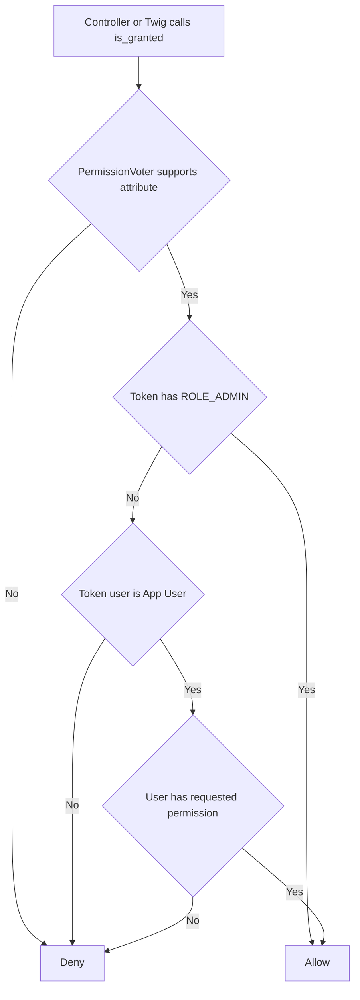

# Admin RBAC and View Pages

This document describes how authorization works in the admin area and how list/view/edit/delete pages are gated.

## Core rule

- Permission checks use `is_granted('<resource>.<action>')`
- Example attributes: `site.list`, `site.view`, `site.edit`, `site.delete`
- `ROLE_ADMIN` bypasses permission checks in `PermissionVoter`

## Decision flow

## Where permissions are enforced

- Controllers use `#[IsGranted(...)]` for route-level checks
- Sidebar navigation in `templates/admin/base.html.twig` uses `is_granted(...)` to hide links
- Show pages can conditionally render links to related entities only when target `.view` permission exists

## Admin pages overview

- List pages: `site.list`, `permission.list`, `role.list`, `user.list`
- Show pages: `site.view`, `permission.view`, `role.view`, `user.view`
- Edit pages: `<resource>.edit`
- Delete actions: `<resource>.delete`

## Route safety note

Show routes use numeric ID constraints (e.g. `/{id<\d+>}`) to avoid collisions with string routes such as `/create`.

## References

- `src/Security/Voter/PermissionVoter.php`
- `templates/admin/base.html.twig`
- `src/Admin/Controller/SiteController.php`
- `src/Admin/Controller/PermissionController.php`
- `src/Admin/Controller/RoleController.php`
- `src/Admin/Controller/UserController.php`
