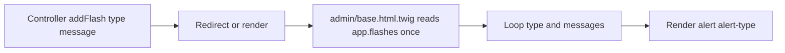

# Flash Messaging Conventions

This document defines flash message semantics used in admin actions.

## Types and intent

- `success`: action completed as expected
- `failed`: validation/input failure (user can fix and retry)
- `warning`: business rule block or non-fatal fallback state

## Render flow

## Styling map

- `.alert-success`: green success state
- `.alert-failed`: red failure state
- `.alert-warning`: yellow warning state

## Important implementation detail

Flash messages must be read once per request render. The base template uses:

- ``
- then checks/iterates `flashes`

This avoids double-consuming the flash bag.

## Typical examples

- `success`: entity created/updated/deleted, host verify succeeded
- `failed`: required field missing, invalid hostname
- `warning`: read-only entity cannot be changed, host verify failed and stays pending

## References

- `templates/admin/base.html.twig`
- `src/Admin/Controller/SiteController.php`
- `src/Admin/Controller/PermissionController.php`
- `src/Admin/Controller/RoleController.php`
- `src/Admin/Controller/UserController.php`
- `src/Admin/Controller/SiteHostController.php`
