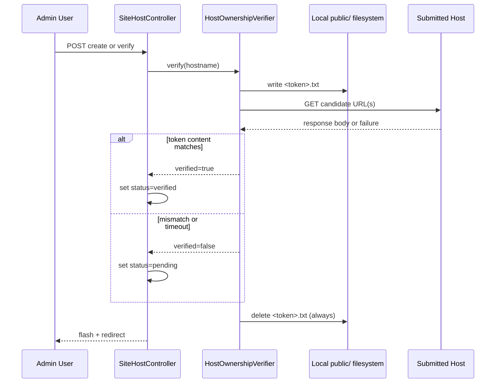

# Host Ownership Verification Flow

This document explains how site host verification works during create and manual re-verify actions.

## What it validates

When a host is submitted (for `site` surface), the app proves ownership by writing a temporary token file to `public/`, then reading that file through the submitted host URL.

- Match found -> host status becomes `verified`
- No match / request failure -> host status becomes `pending`
- Temporary file is always deleted in `finally`

## Sequence

## URL building behavior

Verification URLs are built from current request context when available:

- Primary candidate uses current request scheme (`http` or `https`)
- If current request uses non-default port, that port is included
- Secondary candidate uses the opposite scheme as fallback
- Without current request context, default candidates are:
  - `http://<host>/<token>.txt`
  - `https://<host>/<token>.txt`

## Validation and guardrails

- New hosts are restricted to `surface=site` in create action
- Hostname validation is regex-based (hostname only, no protocol/path)
- Manual verify endpoint allows re-check after DNS/server setup changes

## References

- `src/Admin/Controller/SiteHostController.php`
- `src/SiteHost/Verification/HostOwnershipVerifier.php`
- `src/SiteHost/Verification/HostVerificationResult.php`
- `templates/admin/site_host/list.html.twig`
- `templates/admin/site_host/form.html.twig`
