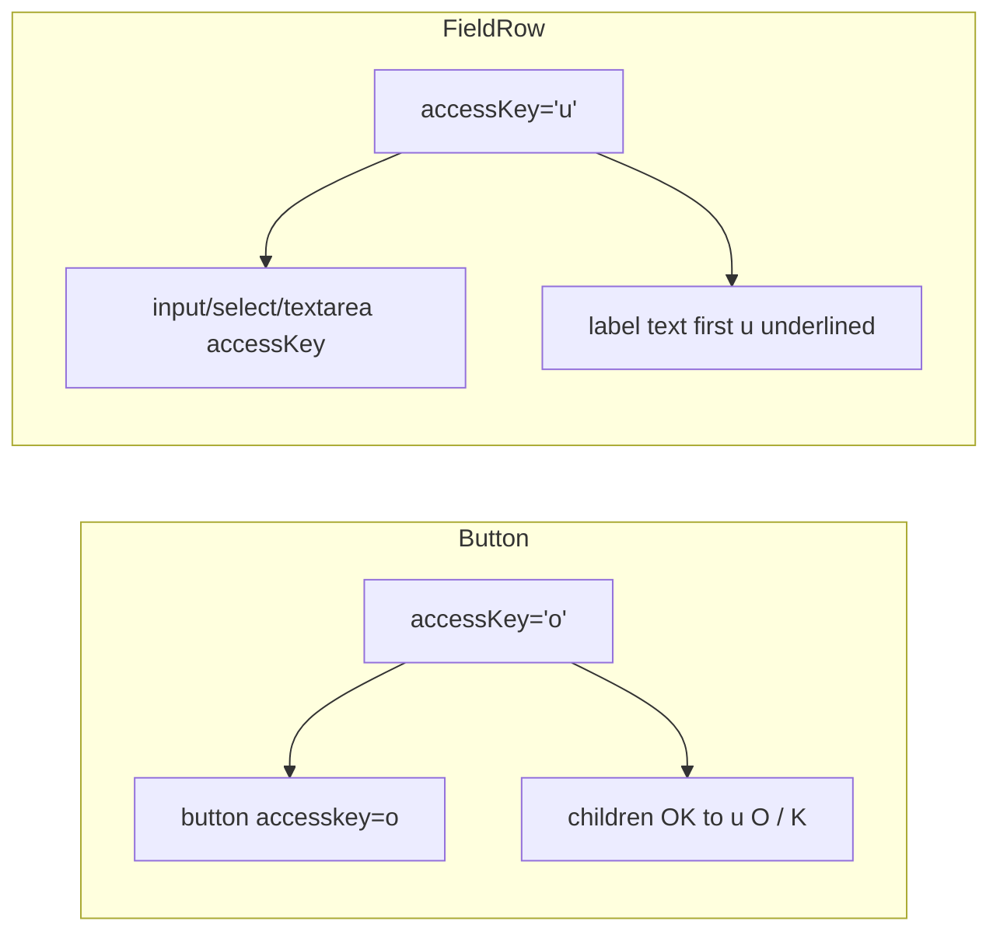

# Dynamic accessKey for Button and FieldRow

> **Parent plan:** [Admin98_Product_Integration.md](./Admin98_Product_Integration.md) — **Phase 3b** (after Phase 3 bricks polish, before Phase 4 PHP surfaces).

## Behavior

- **Match:** case-insensitive first occurrence; keep the original letter case inside `<u>`.
- **No match:** still set the DOM `accesskey`; leave text unchanged.
- **Plain string children only** for auto-underline (e.g. `"OK"`, `"User name:"`). If children are already a React tree (manual `<u>`, nested nodes), set the attribute only — do not rewrite. Callers using `accessKey` should pass plain strings.
- **Intentional vs admin98:** reference puts `accesskey` on `<label>`; we put it on the **control** (input/select/textarea) as specified. Underline still on the label text.

## Shared helper

Add [`webhemi-ui/src/admin/chrome/_lib/underlineAccessKey.tsx`](../../webhemi-ui/src/admin/chrome/_lib/underlineAccessKey.tsx):

- `underlineAccessKey(text: string, key: string): ReactNode`
- `applyAccessKeyToLabel(children: ReactNode, key: string): ReactNode` — map children; for `<label>` (intrinsic or props), underline string/`number` child text
- `applyAccessKeyToControl(children: ReactNode, key: string): ReactNode` — clone the first form control (`input` / `select` / `textarea`, or chrome `TextBox` / `Select` / `TextArea`) with `accessKey={key}`

Export from [`webhemi-ui/src/admin/chrome/index.ts`](../../webhemi-ui/src/admin/chrome/index.ts) only if useful outside; otherwise keep chrome-private.

## Button

Update [`webhemi-ui/src/admin/chrome/Button/Button.tsx`](../../webhemi-ui/src/admin/chrome/Button/Button.tsx):

- Destructure `accessKey` from props (already on `ButtonHTMLAttributes`).
- Pass `accessKey` through to `<button>`.
- When `accessKey` is set and `children` is a string (and not `loading`), render `underlineAccessKey(children, accessKey)` instead of raw children.

Story: add `accessKey` text control on [`Button.stories.tsx`](../../webhemi-ui/src/admin/chrome/Button/Button.stories.tsx) (e.g. default `''` / example story `AccessKey` with `accessKey: 'o'`, children `OK`).

## FieldRow

Update [`webhemi-ui/src/admin/chrome/FieldRow/FieldRow.tsx`](../../webhemi-ui/src/admin/chrome/FieldRow/FieldRow.tsx):

- Extend props: `Omit<HTMLAttributes<HTMLDivElement>, 'accessKey'> & { accessKey?: string; ... }`.
- Do **not** put `accessKey` on the wrapper `div`.
- When `accessKey` is set, map children: underline label text + clone control with `accessKey`.
- Button-only rows (OK/Cancel): ignore — each `Button` owns its own key.

Story: add `accessKey` control on LabelBeside / default FieldRow story in [`FieldRow.stories.tsx`](../../webhemi-ui/src/admin/chrome/FieldRow/FieldRow.stories.tsx).

## Call-site cleanup

Replace manual `<u>…</u>` + missing/partial keys with the API:

- [`DialogWindow.stories.tsx`](../../webhemi-ui/src/admin/bricks/DialogWindow/DialogWindow.stories.tsx) — buttons `accessKey`, field rows `accessKey` + plain label strings
- [`LoginForm.tsx`](../../webhemi-ui/src/admin/components/LoginForm/LoginForm.tsx) — same for Email / Password labels (FieldRow `accessKey`)

## Out of scope

- Radio / Checkbox rows (label is inside the atom)
- Global Alt+key focus manager beyond native `accesskey`
- Changing admin98 sandbox HTML

## Implementation checklist

- [x] underlineAccessKey helper + label/control child mappers
- [x] Button: accessKey attr + string children underline; story control
- [x] FieldRow: accessKey on control, underline label; story control
- [x] Migrate DialogWindow stories + LoginForm off manual `<u>`
