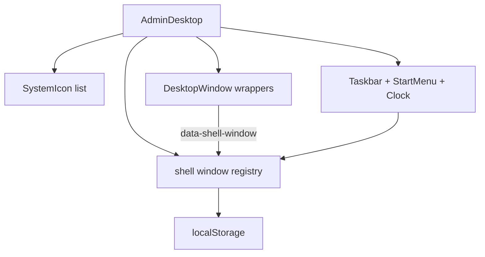

# Admin98 Phase 5 — Desktop shell MVP

> **Status:** done — see [`CURRENT.md`](./CURRENT.md).  
> **Parent plan:** [Admin98_Product_Integration.md](./Admin98_Product_Integration.md)  
> **Surface:** extend Phase 4 [`AdminDesktop`](../../webhemi-ui/src/admin/pages/AdminDesktop.tsx) into real shell behavior (drag, taskbar, Start, persistence).  
> **Rhythm:** one slice → one commit (same as FileExplorer).

## Context

- Live surface: [`AdminDesktop.tsx`](../../webhemi-ui/src/admin/pages/AdminDesktop.tsx) — cascade placement + z-raise on mousedown; **no** drag/taskbar/persistence.
- Styles already exist: [`_toolbar.scss`](../../webhemi-ui/src/admin/styles/product/_toolbar.scss) (`#toolbar`, Start menu, task buttons, clock), [`_desktop.scss`](../../webhemi-ui/src/admin/styles/product/_desktop.scss).
- Chrome ready: `TitleBar` `inactive`, `TitleBarControl` Minimize/Maximize/Restore/Close, `.window.resizable` layout class — **no** resize handles yet (noted in [`windowBrickStory.tsx`](../../webhemi-ui/src/admin/bricks/_lib/windowBrickStory.tsx)).
- Behavior reference (sibling repo): `webhemi-admin98` → `assets/script/{desktop,windowHandler,taskbarHandler,iconHandler,main}.js`.
- Product storage key namespace: `webhemi.admin.desktop…` (not demo `webhemi.demo.desktop…`).

## Architecture

- Keep public export **`AdminDesktop`** (PHP controller unchanged).
- Add shell modules under [`webhemi-ui/src/admin/shell/`](../../webhemi-ui/src/admin/shell/) (new): registry helpers, `DesktopWindow`, `Taskbar`, `StartMenu`, persistence — not a second NPM entry.
- Shell windows only: wrappers with `data-shell-window` + stable `id` (`control-panel`, `site-{id}`). Nested `.window` (explorer Properties, tabs) must **not** be treated as shell windows.
- `#toolbar` is **not** a shell window (matches admin98 filter).

## Slices (one function → one commit)

### Slice A — Shell registry + active/inactive — **done**

- Refactor open-window state into a typed registry: `{ id, kind, title, left, top, z, width?, height?, minimized, maximized, restore? }`.
- Raise-on-activate; exactly one active window; pass `inactive={!active}` into Control Panel / SiteFileExplorer shells.
- Mark wrappers `data-shell-window` + `id`.
- Storybook: activate switches title-bar inactive class (`ActiveInactive`).

### Slice B — Title-bar drag — **done**

- Pointer capture on title-bar (ignore controls clicks); threshold ~4px (admin98 `DRAG_THRESHOLD_PX`).
- Clamp to `.dashboard` bounds (account for taskbar height once C lands; until then full viewport).
- No HTML5 `draggable` on windows (use pointer events; keep icon drag separate if ever needed).
- Storybook: `TitleBarDrag`

### Slice C — Taskbar + minimize/restore — **done**

- React `Taskbar`: `#toolbar.window` markup matching existing SCSS (Menu button, `.task-buttons`, clock).
- Dynamic task buttons for open windows (site + control-panel icons via existing CSS classes).
- Wire Minimize / task-button click: minimize ↔ restore + raise; active task = `aria-pressed`.
- Desktop `min-height` / icon list already reserve ~40px — keep taskbar fixed bottom.
- Storybook: `TaskbarMinimize`

### Slice D — Start menu — **done**

- Popup matching `_toolbar.scss` / admin98 markup (banner “WebHemi 1.0”).
- MVP items: **Control Panel** (opens/raises), **Logout** (optional `logoutHref` prop from Twig → `app_logout`; if omitted, disabled).
- Other demo items (Uploads, Search, Logs, About): present **disabled** stubs.
- Click-outside / Escape closes; Menu button `aria-expanded`.
- Storybook: `StartMenuControlPanel`

### Slice E — Resize + maximize — **done**

- Edge handles for `e|w|s|se|sw` only (no top — title-bar drag stays free), cursors per admin98.
- Min size helpers; maximize/restore stores restore rect; sync Maximize↔Restore `aria-label`.
- Apply size on `DesktopWindow` wrapper; title-bar dblclick toggles maximize.
- Storybook: `MaximizeRestore`, `ResizeHandle`

### Slice F — Persistence — **done**

- `localStorage` key `webhemi.admin.desktop.windows.v1` (override via `persistenceKey`; `false` disables).
- Persist per window id: position, size, z, minimized/maximized; closed windows keep geometry for reopen.
- Debounce writes after drag/resize/chrome changes; hydrate open windows on mount.
- Storybook: `Persistence`

## Phase 5 status — **done**

Demo-like shell: drag, resize, maximize, taskbar, Start → Control Panel (+ Logout), positions survive refresh.
