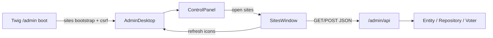

# Admin98 Phase 6 — Admin windows via API

> **Parent plan:** [Admin98_Product_Integration.md](./Admin98_Product_Integration.md)  
> **Surface:** open real admin CRUD from the Retro OS shell (Control Panel → Sites, later Hosts, …), backed by `/admin/api/*`.  
> **Rhythm:** one slice → one commit (same as Phase 5 / FileExplorer).

## Decision (locked)

- **API-first.** The live admin UI is React (`AdminDesktop`). Twig only boots the shell (and may pass bootstrap props such as desktop site icons + CSRF). List/create/update/delete go through JSON under `/admin/api`.
- **PHP keep:** entities, repositories, voters/permissions, domain services (e.g. host verification).  
- **PHP discard (Phase 7, or sooner once replaced):** legacy HTML CRUD routes (`admin_sites` / `admin_hosts` redirects), Twig `sites.html.twig` / `hosts.html.twig`, modern `SitesPage` / `HostsPage` / `AdminLayout` stack. Use them as **behavior reference** only.
- **First vertical slice: Sites.** Hosts mirrors the same pattern next. Other Control Panel icons stay selection-only or open a short “not implemented” dialog until their slices.
- **Storybook:** props-driven window UI first; MSW handlers land with the first fetch/save stories (feeds Phase 6b).

## Context

| Piece | Today | Phase 6 target |
|-------|--------|----------------|
| Shell | [`AdminDesktop`](../../webhemi-ui/src/admin/pages/AdminDesktop.tsx) — kinds `control-panel` \| `site` | + `sites` (then `hosts`) shell windows |
| Control Panel | Select-only icons ([`ControlPanel.tsx`](../../webhemi-ui/src/admin/components/ControlPanel/ControlPanel.tsx)) | Double-click / Open → raise Sites (Hosts, …) window |
| API | GET `/admin/api/sites`, `/hosts`, `/me` ([`AdminApiController`](../../webhemi-php/src/Controller/Api/AdminApiController.php)) | + mutating Sites (then Hosts); stable JSON error shape |
| Legacy pages | `SitesPage` / `HostsPage` + `AdminLayout` + shared form atoms; PHP routes redirect to dashboard | Not mounted; replace with Retro windows + chrome atoms |
| Auth | Session after form login; `json_login` at `/admin/api/login` exists | Same-origin `fetch` with session cookie + CSRF on writes |
| Permissions | `site.list` / `site.edit`, `host.list` / `host.edit` / `host.verify` (seed) | GET → `*.list`; create/update → `*.edit` |

## Architecture



- Keep public export **`AdminDesktop`** (PHP React controller unchanged as the shell mount).
- New UI under `webhemi-ui/src/admin/` — prefer **window surface** (brick or `pages/`) composed from chrome atoms (`Table`, `FieldRow`, `Button`, `TextBox`, `StatusBar`, heading-panel layout). Do **not** extend `AdminLayout` / shared modern form stack.
- Small **`admin/api`** client helper (base path, credentials, CSRF header, typed envelopes) — not a second NPM entry.
- Shell window ids: `sites`, `hosts` (stable for persistence).

## JSON contract (minimal)

Success list (existing shape, keep):

```json
{ "data": [ { "id": 1, "slug": "main", "name": "Main site", "enabled": true, "hostCount": 1 } ] }
```

Success create:

```json
{ "data": { "id": 2, "slug": "blog", "name": "Blog", "enabled": true, "hostCount": 0 } }
```

Error:

```json
{ "error": { "code": "validation_failed", "message": "…", "fields": { "slug": "…" } } }
```

HTTP: `401` / `403` / `404` / `422` / `409` as appropriate. No HTML error pages for `/admin/api/*`.

**CSRF (writes):** Twig passes `apiCsrfToken` (`csrf_token('admin_api')`) into `AdminDesktop`. Client sends `X-CSRF-TOKEN` (and `Accept: application/json`). PHP validates token id `admin_api` on POST/PATCH/DELETE.

## Slices (one function → one commit)

### Slice A — Sites write API (PHP) — **done**

- `POST /admin/api/sites` (`site.edit`): body `{ name, slug, enabled? }`; persist via `SiteCreator` + `Site` / `SiteRepository`; unique slug → `409`.
- Shared JSON helpers under [`src/Api/`](../../webhemi-php/src/Api/) (`ApiJson`, `CreateSiteInput`, `SiteApiMapper`, `SiteCreator`).
- CSRF: `#[IsCsrfTokenValid('admin_api', …)]` via `X-CSRF-TOKEN` header on mutating routes.
- Unit tests: validation, envelopes, mapper, create + duplicate slug (`tests/Unit/Api/`).
- GET list unchanged (uses `SiteApiMapper`; ordered by name).

**Out of scope for A:** React UI, Hosts writes, deleting legacy Twig routes. HTTP 403 (forbidden) covered by `#[IsGranted('site.edit')]` + existing `PermissionVoter` tests — no WebTestCase suite yet.

### Slice B — Sites window UI (props + Storybook) — **done**

- Brick: [`HeadingPanelWindow`](../../webhemi-ui/src/admin/bricks/HeadingPanelWindow/) (`heading-panel-layout` + `.panel.actions` padding; first-panel bleed padding so captions are not clipped).
- Surface: [`SitesWindow`](../../webhemi-ui/src/admin/components/SitesWindow/SitesWindow.tsx) — table; actions **New / Edit / Delete / Cancel**.
- **New/Edit** open [`SiteFormDialog`](../../webhemi-ui/src/admin/components/SitesWindow/SiteFormDialog.tsx): tabs **General** (name/slug/enabled) + **Hosts** (assign existing hosts via checkboxes; **Add…** stub → Hosts Add modal later). Edit prefills; New is empty.
- Hosts list is props-driven until the Hosts API slice; create API still ignores `hostIds` for now.
- Storybook: `Admin/Components/SitesWindow` (list states + New/Edit dialog + validation plays).

**Out of scope for B:** wiring Control Panel; PHP; MSW (full MSW = 6b).

### Slice C — Shell open + live fetch — **done**

- Shell kind `sites` (`SITES_WINDOW_ID`), default size, persistence hydrate, taskbar `.task.sites` icon.
- Control Panel: double-click / Open on **Sites** → open or raise Sites window.
- [`AdminDesktop`](../../webhemi-ui/src/admin/pages/AdminDesktop.tsx): mounts `SitesWindow`; `GET/POST /admin/api/sites` via [`admin/api`](../../webhemi-ui/src/admin/api/); refreshes list + desktop icons after create.
- Twig: `apiCsrfToken: csrf_token('admin_api')` on [`dashboard.html.twig`](../../webhemi-php/templates/admin/dashboard.html.twig).
- Storybook: `OpenSitesWindow` (injectable `sitesApi` mock).

**Done when:** from `/admin`, Control Panel → Sites shows DB sites and can create one without leaving the shell.

### Slice D — Deep link `?window=…` — **deferred**

Skipped for now (only `sites` would have shipped; not useful until a full deep-link acceptance criteria exists). Not part of Hosts (Slice E). Revisit after admin windows are complete.

### Slice E — Hosts (API + window + shell) — **done**

- Mirror A–C for hosts: `POST /admin/api/hosts`, Retro Hosts window, kind `hosts`, Control Panel open, refresh as needed.
- First Hosts slice = list + create only (verify / assign deferred — see [Host_Ownership_Verification.md](./Host_Ownership_Verification.md)).
- No deep links in this slice.
- PHP: `CreateHostInput`, `HostCreator`, `HostApiMapper`, CSRF + `host.edit`.
- UI: `HostsWindow` / `HostFormDialog`; shell `HOSTS_WINDOW_ID`; Sites form **Add…** opens Hosts.
- Storybook: `Admin/Components/HostsWindow`, `OpenHostsWindow`.
**Temporary create contract (Slice E):** superseded in part — hosts may be created **without** `siteId`; Sites Hosts tab lists assigned hosts only (Name/Status) with Remove = unassign. Verify API + Hosts **Verify** (H2) landed; assign-to-site (H3) remains in [Host_Ownership_Verification.md](./Host_Ownership_Verification.md).

### Slice F — Operator feedback — pending

- Status-bar messages and/or small message `.window` dialog for API errors / success (replace legacy `FlashList` role).
- Consistent handling of `401` (redirect login) vs `403`/`422` in-window.
- Load/verify/save errors already use Error MessageDialog + chord in Sites/Hosts; Slice F may add success / richer status-bar copy.

### Follow-up — Host ownership (H1–H3)

> **Plan:** [Host_Ownership_Verification.md](./Host_Ownership_Verification.md)

pending → verify → verified → assign to site → active. Uses existing `HostOwnershipVerifier`. **H1–H3 done;** H4 docs/seed open.
## Explicitly deferred

- Roles / Permissions / Users / Settings / Themes windows (CP icons remain inert or stub dialog).
- Editing/deleting sites beyond create+list (follow-up once list UX settles).
- Dropping Twig bootstrap `sites` prop entirely (can keep for first paint; API remains source of truth after Sites opens / after create).
- Deleting legacy modern pages/routes (Phase 7 cleanup, unless a slice is blocked by confusion — then delete early with checklist).
- Full MSW package setup (Phase 6b); Slice C may add minimal handlers only as needed.
- SPA router / leaving AssetMapper shell mount.
- Deep links (`?window=…`) — deferred until a dedicated acceptance criteria; not in Hosts.
- Host ownership verify/assign lifecycle — [Host_Ownership_Verification.md](./Host_Ownership_Verification.md) (H1–H3); not part of Slice E/F MVP.

## Phase 6 status — **in progress** (Slices A–C + E done; D deferred; F pending)

**Near-term done when:** Sites list+create works end-to-end from the shell via API (Slice C).  
**Phase done when:** Sites + Hosts reachable from Control Panel via API; legacy CRUD pages unused and scheduled for Phase 7 delete.
