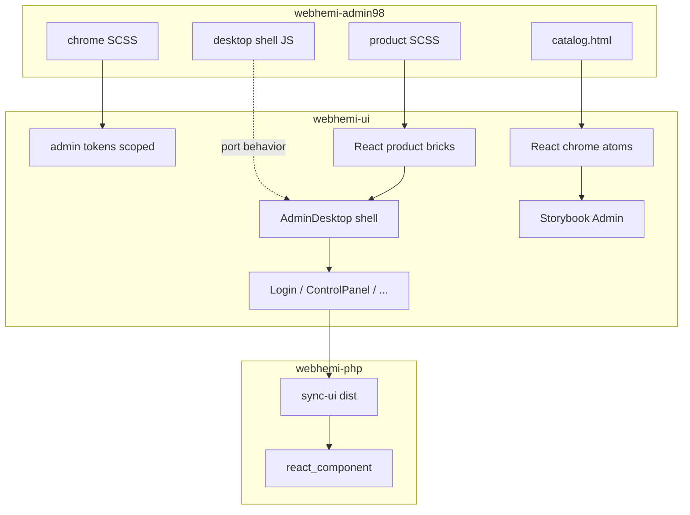

# Admin98 → WebHemi product integration

Integration plan for bringing the [webhemi-admin98](https://github.com/Gixx/webhemi-admin98) Retro OS tech demo into the real WebHemi product (`@webhemi/ui` + PHP AssetMapper).

## Fixed decisions

Canonical detail: **[Admin98_Integration_Contract.md](./Admin98_Integration_Contract.md)** (Phase 0 ADR). Summary:

- **Target package:** all product UI lives in [`webhemi-ui`](../../webhemi-ui/) (`@webhemi/ui`). [webhemi-admin98](https://github.com/Gixx/webhemi-admin98) remains a **reference / sandbox** until Storybook parity; not a separate NPM dependency. UX parity matters; byte-identical markup does not.
- **Product concept:** Admin theme (Retro OS) + swappable, **self-contained** frontend themes. No shared UI kit — each theme owns tokens, styles, and components. Thin `src/lib/` helpers (e.g. `cn`) are OK; UI atoms are not.
- **Current trees are throwaway / relocatable:** today’s `src/admin/**` is a full rewrite target (not a restyle). Today’s `src/shared/components/*` move into `themes/default` (or are rewritten there) as Default work proceeds — Admin never imports them.
- **Admin98 assets are admin-only:** icons, fonts, chrome/product styles, shell behavior serve **only** the Admin theme. Frontend themes do not import Admin chrome.
- **Theme scope:** `[data-wh-theme="admin"]` on `<html>` only. `body.dashboard` / `.wh-admin` are **not** product contracts (sandbox may still use `body.dashboard` as a demo shell).
- **Markup:** 98-compatible class names (`.window`, `.field-row`, …); no `wh-` rename wave initially.
- **Delivery path:** unchanged — `npm run build` → `dist/` → PHP `bin/sync-ui.sh` / `composer run sync-ui` → AssetMapper + `react_component(...)` ([Local development](../local-dev.md)).
- **Order:** styles → chrome atoms (Storybook) → product layout bricks → AdminDesktop (Login already; site icons + Control Panel + stubs) → desktop shell MVP → admin windows via `/admin/api` (Sites, then Hosts).



---

## Phase 0 — Integration contract (1–2 days) — **done**

**Work:** ADR under hub `docs/plan/`: layers, markup contract, theme-scope rule, theme ownership, what stays in the sandbox; PHP `data-wh-theme` wiring.

**Outputs:**
- Contract: [Admin98_Integration_Contract.md](./Admin98_Integration_Contract.md).
- Chrome markup = 98-compatible class names (`.window`, `.field-row`, `aria-label` title controls) — no `wh-` prefix rename initially.
- Admin CSS applies only under `[data-wh-theme="admin"]` (not `body.dashboard` / `.wh-admin`).
- Frontend themes do **not** import Admin chrome SCSS; no shared UI layer.
- PHP base layout: `<html data-wh-theme="admin">` (login + admin; site themes override later).

**Hard parts (resolved in ADR):**
- Storybook toolbar already uses `data-wh-theme` ([`.storybook/preview.tsx`](../../webhemi-ui/.storybook/preview.tsx)) — product scope aligns to it.
- Trade dress / IP intentionally out of scope; this plan is architecture only.

---

## Phase 1 — Move the style system into `webhemi-ui` — **done**

**Work:** copy / adapt:
- tokens (`assets/style/abstract/tokens.css` in admin98 + `@theme`)
- bevel mixins + `chrome/` partials
- product partials (layouts, scrollbar skin, desktop, toolbar) — initially as **CSS**, without React
- icon / font assets

Layout:

```text
webhemi-ui/src/admin/styles/
  tokens.css
  fonts.css
  abstract/        # bevel mixins
  chrome/          # ported SCSS + icons
  product/         # shell + layouts
  entry.scss       # meta.load-css under [data-wh-theme="admin"]
webhemi-ui/src/admin/assets/
  system/          # banners, fixed system art
  fonts/ icons/{system,explorer,toolbar}/ logo/ chrome/
webhemi-ui/src/styles/
  platform.css     # Tailwind theme+utilities, no Preflight
  entry.js         # Vite CSS entry
# PHP after sync-ui:
#   assets/webhemi-ui/index.js     shared package
#   assets/admin/index.css + …     Admin Theme CSS + graphics (stable names)
#   assets/themes/<id>/            frontend themes (later)
```

Build: `vite.css.config.ts` (+ `sass`); Storybook imports the same SCSS entry. `cssMinify: false` for `@media (not (hover))`.

**Hard parts (handled):**
- Global `button` / `input` → nested via `meta.load-css` under `[data-wh-theme="admin"]`.
- No `body.dashboard` contract — product shell styles `body` under the theme scope.
- Preflight omitted (`platform.css`); Default theme owns its body face in `themes/default/styles/tokens.css`.
- Smoke story: `Admin/Foundations/CatalogSmoke` (removed during Phase 3 Storybook cleanup; atom/brick stories are the regression surface).

**Done when:** in Storybook with Admin theme, chrome/product styles load under `[data-wh-theme="admin"]` and match admin98 catalog samples.

---

## Phase 2 — React chrome atoms + Storybook Atoms — **done**

**Work:** thin React wrappers per catalog section that **preserve the DOM contract** (e.g. checkbox: `input` immediately before `label`). Story sources: admin98 `catalog.html` examples + its atom catalog plan hierarchy.

**Delivered under** [`webhemi-ui/src/admin/chrome/`](../../webhemi-ui/src/admin/chrome/) (one folder per atom + `_lib/` for shared helpers):
Button, TextBox/TextArea, Checkbox, Radio, Select, FieldRow/GroupBox, Window/TitleBar/StatusBar, Tabs/`TabPanel`, TreeView, SunkenPanel/FieldBorder, Table + `useTableView`, Progress, Slider. (`SystemIcon` landed in Phase 3 as chrome atom.)

Storybook: **Admin/Atoms/** + Foundations CatalogSmoke rewritten to use atoms. LoginForm composed from chrome + `dialog-panel-layout` (early Phase 4 surface). Package root exports Admin chrome `Button`/`Checkbox`/`Select` (shared duplicates not re-exported).

**Hard parts (handled):**
- Adjacency: Checkbox/Radio are fragments (`input` + `label`); FieldRow wraps without breaking `+`.
- `TabPanel` ≠ `Window` (same `.window` class, different component).
- Interactive table: `useTableView` ports admin98 `tableView.js`.

**Done when:** Admin / Atoms sidebar populated; Default stories stay on `data-wh-theme="default"` via preview section rule.

---

## Phase 3 — Product bricks (layouts, scrollbar)

**Status:** done (`src/admin/bricks/` — one folder per brick + `_lib/`; Storybook `Admin/Bricks/*`).

**Delivered:**
- `DialogWindow`, `IconPanelWindow`, `WizardWindow` (`HeadingPanelWindow` removed — rewrite later)
- Custom scrollbar as **chrome capability** (`Scrollable`, `SunkenPanel`/`FieldBorder` `scrollable` prop, `useCustomScrollbar` / `attachCustomScrollbar`) — not a product brick
- `SystemIcon` as **chrome atom** (desktop + icon panels; Taskbar / StartMenu deferred to Phase 5)
- `LoginForm` refactored onto `DialogWindow`
- Next brick: [`FileExplorerWindow`](./FileExplorer_Window.md) — slices A–I done (nav, menubar, site open, delete/undo, clipboard, properties, splitter, multi-select, drag-drop); PHP tree + MenuBar extract remain

**Hard parts (resolved / noted):**
- Scrollbar: chrome owns `.scrollable` / viewport; effect mounts `.sb-*` rails only (`SunkenPanel`/`FieldBorder` `scrollable` or `Scrollable` for layout hosts).
- Layout negative-margin / groove rules — verify visually vs sandbox in Storybook.

---

## Phase 3b — Dynamic `accessKey` (chrome polish)

**Status:** done (detail: [AccessKey_Dynamize.md](./AccessKey_Dynamize.md)).

**Why here:** chrome atoms and dialog bricks exist; Login / Control Panel (Phase 4) should consume the API instead of hand-rolled `<u>` markup. Deferred from Phase 3 fine-tuning so that work stays a focused chrome change.

**Work:**
- Helper: underline first matching letter (case-insensitive) in plain-string labels/button text
- `Button`: `accessKey` → DOM attribute + auto `<u>` in string children
- `FieldRow`: `accessKey` → attribute on the control; `<u>` on the associated `<label>` text (not on the wrapper `div`)
- Stories + migrate `DialogWindow` stories / `LoginForm` off manual `<u>`

**Done when:** Storybook Controls can set keys; login/dialog samples use the API; no double-wrapping of existing React-tree children.

---

## Phase 4 — First product surfaces (desktop MVP in PHP)

**Status:** done.

**Scope change:** no hybrid with the modern `AdminLayout` UI. Post-login `/admin` is a Retro OS **desktop surface** (icons + openable windows). Full window manager (drag, taskbar, z-order persistence) remains **Phase 5**.

**Work:**

1. **Login** — already Retro OS (`LoginPage` / `DialogWindow`); keep Twig props (`action`, CSRF, error).
2. **`AdminDesktop` on `/admin`** — teal desktop with:
   - one `SystemIcon kind="site"` per site from the DB (`id`, `name`, `slug`, …)
   - one `SystemIcon kind="control-panel"` that opens Control Panel
3. **Control Panel** — `IconPanelWindow` (Storybook Control Panel pattern): static admin icons; selection updates info/status; **Close** dismisses. No navigation to legacy CRUD pages.
4. **Site open** — double-click / `onOpen` opens a **stub** `DialogWindow` (site title + short placeholder; Close / OK dismisses). Real site admin UI is Phase 6.
5. **Legacy admin UI** — stop mounting `AdminLayout` / `SitesPage` / `HostsPage`. `/admin/sites` and `/admin/hosts` redirect to `admin_dashboard`. Delete leftover modern pages in Phase 7.

Export `AdminDesktop` via [`admin/index.ts`](../../webhemi-ui/src/admin/index.ts) + PHP `assets/react/controllers/AdminDesktop.js` + Twig `react_component`.

**Hard parts:**
- AssetMapper only sees built `dist` — local loop: UI build + `sync-ui` (or `make up` watch) is required.
- Windows are absolutely positioned with simple cascade; no drag/resize/taskbar until Phase 5.
- Title-bar **Close** must be wired with `onClick` (chrome `TitleBarControl` has no default behavior).

**Done when:** after login, `/admin` shows site icons (when DB has sites) + Control Panel icon; Control Panel and site stub windows open and close; modern admin chrome is no longer the live `/admin` UI.

---

## Phase 5 — Desktop shell MVP (React)

> **Slice plan:** [Admin98_Phase5_Desktop_Shell.md](./Admin98_Phase5_Desktop_Shell.md) (source of truth for A–F) — **done**.

**Status:** done.

---

## Phase 6 — Admin windows via API

> **Slice plan:** [Admin98_Phase6_Admin_Windows.md](./Admin98_Phase6_Admin_Windows.md) (source of truth for A–F).

**Status:** in progress (Slices A–C + E done; D deferred; F pending).

**Decision:** API-first. Twig only boots `AdminDesktop` (bootstrap props + CSRF). Sites/Hosts CRUD is JSON under `/admin/api`. Legacy `SitesPage` / `HostsPage` / HTML CRUD routes are reference only — not the production path. PHP entity/repository/voter/domain services stay.

**Work (summary):**
1. Expand `/admin/api` with mutating Sites (then Hosts) + stable error envelope + CSRF on writes.
2. Retro Sites/Hosts windows (chrome atoms + heading-panel), opened from Control Panel.
3. Shell kinds `sites` / `hosts` (deep links deferred — separate acceptance criteria later).
4. First vertical slice = Sites list+create end-to-end; Hosts mirrors next.
5. Host ownership verify/assign (pending → verified → active): [Host_Ownership_Verification.md](./Host_Ownership_Verification.md) — after Slice E; not blocking F.

**Hard parts:**
- Session `fetch` + CSRF; permission checks (`site.list` / `site.edit`, …).
- Refresh desktop site icons after create.
- Modal vs Window: native `.window` / status-bar instead of legacy `FlashList` / `Modal`.

**Done when:** Sites + Hosts reachable from the shell via API; old AdminLayout stack unused (delete in Phase 7).

---

## Phase 6b — Storybook MSW for Admin data surfaces

**Status:** planned (after Slice C needs fetch/save demos; may start minimal handlers earlier).

**Why here:** Phase 4–5 stayed props-driven. Phase 6 production path is `/admin/api`; Storybook needs **fake APIs** so windows stay reviewable without PHP.

**Work (inspiration only — no vendor code):**
- Add `msw` + `msw-storybook-addon`; initialize in `.storybook/preview` with `onUnhandledRequest: 'bypass'`
- Co-locate handlers next to the Admin surface/feature (not in package `exports` / `dist`)
- Stories declare `parameters.msw.handlers` for empty / populated / error cases
- Handlers mirror the live `/admin/api` contract from Phase 6

**Done when:** at least one list or save flow is demoable in Storybook via MSW without a running Symfony backend.

**Out of scope for 6b:** replacing AssetMapper mounts; shipping mock workers in the published NPM package.

---

## Phase 7 — Cleanup and packaging

**Work:**
- Delete unused legacy admin components/stories; finish relocating former `shared` UI into `themes/default` (or remove if unused).
- Storybook sidebar: **Admin / Atoms|Bricks|Components|Foundations** + **Themes / Default** (frontend). Sidebar order is pinned via `storySort` in `.storybook/preview.tsx` (extend the `order` array when adding sections).
- Consider `dist` CSS split: `styles.css` = admin (default export for PHP); separate frontend theme CSS later if the site surface becomes React.
- Sandbox: README pointer “canonical stories in webhemi-ui”; `catalog.html` optional visual regression or archive.
- Hub README / architecture doc: Admin Theme = Retro OS owned chrome; themes are self-contained.

**Hard parts:**
- Public NPM breaking visual change (`@webhemi/ui`) — `0.x` is fine, but changelog is required.
- Chromatic / visual tests: introduce on chrome atoms before the shell makes diffs noisy.

---

## Suggested timeline (indicative)

| Phase | Time (indicative) | Main risk |
|-------|-------------------|-----------|
| 0–1 | 3–5 days | Theme-scope, Sass/Tailwind build parity |
| 2 | 1–2 weeks | DOM contract in React, story backlog |
| 3 | 3–5 days | Scrollbar + layout pixel fidelity |
| 3b | 1–2 days | accessKey helper edge cases (non-string children) |
| 4 | 3–5 days | PHP sync + Login parity |
| 5 | 1.5–3 weeks | Window manager fidelity |
| 6 | ongoing | API + window migration (Sites first) |
| 6b | 2–4 days | MSW handler fidelity vs `/admin/api` |
| 7 | ongoing | Breaking cleanup |

---

## Explicitly out of scope

- Making frontend (site) themes Retro OS
- Sharing admin98 chrome/icons/scripts with frontend themes (admin-only by design)
- Replacing `webhemi-js` / Payload admin
- Publishing admin98 as its own NPM package
- Reintroducing the npm `98.css` dependency

---

## Phase checklist

- [x] Phase 0 — Integration contract
- [x] Phase 1 — Styles into `webhemi-ui` (scoped)
- [x] Phase 2 — React chrome atoms + Storybook
- [x] Phase 3 — Product layout bricks; SystemIcon as chrome atom; scrollbar as chrome capability
- [x] Phase 3b — Dynamic accessKey (Button + FieldRow); see AccessKey_Dynamize.md
- [x] Phase 4 — AdminDesktop (site icons + Control Panel + site stubs) via PHP; drop live AdminLayout
- [x] Phase 5 — React AdminDesktop shell (drag, taskbar, z-order, persistence)
- [ ] Phase 6 — Sites/Hosts windows via `/admin/api` (see Admin98_Phase6_Admin_Windows.md)
- [ ] Phase 6b — Storybook MSW for Admin data surfaces
- [ ] Host ownership verify/assign — [Host_Ownership_Verification.md](./Host_Ownership_Verification.md)
- [ ] Phase 7 — Remove legacy admin UI; docs/changelog; sandbox role update
