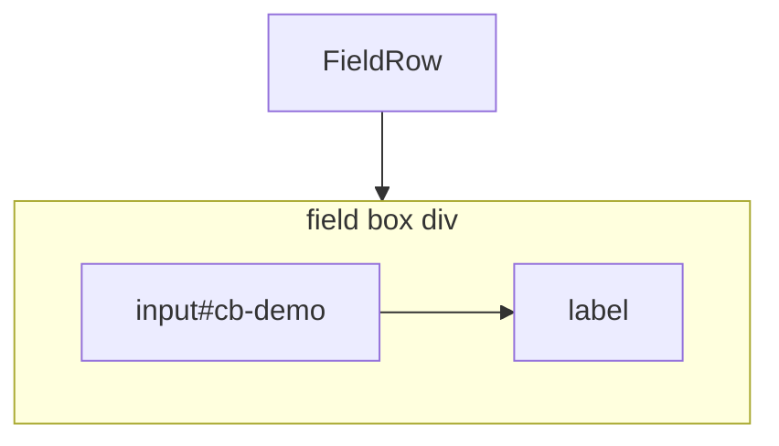
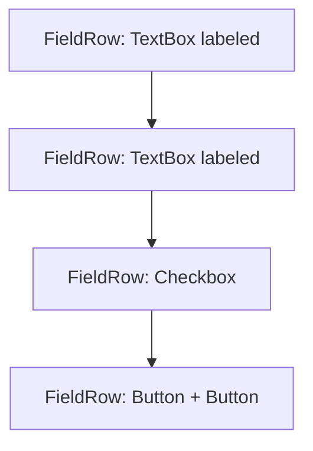

# Field layout redesign (labels, FieldRow, GroupBox)

> **Parent plan:** [Admin98_Product_Integration.md](./Admin98_Product_Integration.md) — chrome form atoms polish (after Phase 3b accessKey).  
> **Related:** [AccessKey_Dynamize.md](./AccessKey_Dynamize.md).

Two sequential slices: (1) field boxes + labels on form atoms, (2) FieldRow / GroupBox layout contract and removal of FieldColumn.

**Guideline:** atoms should be usable and understandable on their own (Storybook, Docs, composition). Shared `_lib` helpers are fine when they encode a shared DOM/CSS contract — independence is a direction, not a ban on helpers.

---

## Step 1 — Field boxes + labels

### Goal

Unify form field atoms so each labeled control is a single **field box**: one wrapper that owns the caption + control pair.

**In scope:** Checkbox, Radio, TextBox, TextArea, Select, Slider.  
**Out of scope for field-box API:** Button (caption is `children` on the control itself).

### Target markup

```tsx
<Checkbox id="cb-demo" label="Remember me" />
```

```html
<div class="…optional boxClassName…">
  <input id="cb-demo" type="checkbox" … />
  <label for="cb-demo">Remember me</label>
</div>
```

- No derived wrapper id (avoid `` `${id}-box` `` collision traps). Control keeps `id`; wrapper is anonymous except for optional `boxClassName`.
- Wrapper uses a dedicated chrome class (e.g. `.field-box`, plus a modifier for `labelPosition="above"`). Avoid ad-hoc inline layout styles.
- `className` stays on the **control** (widths / utilities like `w-window-xs`). `boxClassName` is only for the wrapper.
- Do **not** put an extra wrapper between `input` and `label` — the box wraps the **pair**. Chrome `input + label` selectors stay valid for Checkbox/Radio ([Admin98_Integration_Contract.md](./Admin98_Integration_Contract.md) adjacency rule).



### Shared helper

Keep a thin `chrome/_lib` helper (e.g. `renderFieldBox`) for wrapper + label/control order. Same idea as `underlineAccessKey` — private contract helper, not a public atom.

### Checkbox / Radio

- Required `label` + `id` (unchanged).
- Fixed DOM order: **control then label** (chrome CSS). **No `labelPosition` prop** — no Win98 precedent for other arrangements.
- Always render the field box around the pair.
- `boxClassName?`, `accessKey?` (underline on plain-string label; attribute on control).

### TextBox / TextArea / Select / Slider

| Prop | Type | Notes |
|------|------|--------|
| `label` | `ReactNode?` | Omit / undefined → bare control, no box (Storybook demos, unlabeled use). Set → field box + require `id`. |
| `labelPosition` | `'before' \| 'above'` | Only when `label` is set. Default: `before`. |
| `boxClassName` | `string?` | Classes on the wrapper `div`. |
| `accessKey` | `string?` | On the control; plain-string `label` gets `<u>`. |

| `labelPosition` | DOM order | Box layout |
|-----------------|-----------|------------|
| `before` | label → control | row |
| `above` | label → control | column |

No `after` (not needed for these controls). No `none` — unlabeled is simply “no `label` prop”.

`above` replaces today’s FieldRow `stacked`.

### Slider

- Drop the `vertical` prop and `.is-vertical` wrapper path — not needed for intended Admin UI (no volume-style vertical track).
- Horizontal range only; labeled via the same field-box API as TextBox.

### Storybook (step 1)

Controls **and Docs** for the props each atom actually has:

- Checkbox / Radio: `label`, `boxClassName`, `accessKey` (no `labelPosition`).
- TextBox / TextArea / Select / Slider: `label`, `labelPosition` (select: `before` | `above`), `boxClassName`, `accessKey`.
- Button-style: `controls.include` + `argTypes` with `description` / `table.type` / `table.defaultValue`.

---

## Step 2 — FieldRow, drop FieldColumn, GroupBox atom

### Goal

After field boxes own caption layout, today’s FieldRow job (label+control pairing, `stacked`, `accessKey` rewriting) is obsolete. FieldRow becomes a **horizontal group**. Sibling FieldRows stack vertically. FieldColumn goes away. GroupBox is a first-class Storybook atom that only contains FieldRows.

### FieldRow (new contract)

**Responsibility:** lay out its children **in a row** (side by side).

**Recommended children** (convention, not enforced — like HTML content models):

- Button
- TextBox
- TextArea
- Checkbox
- Radio
- Select
- Slider

**Not a FieldRow child:** GroupBox (no Win98 precedent; GroupBox is a **parent** of FieldRows only).

**Removed from FieldRow:**

- `stacked` (use `labelPosition="above"` on labeled text-like atoms)
- `accessKey` child rewriting (use atom / Button `accessKey`)

**Sibling FieldRows:** consecutive FieldRows appear **one under another** (block stack — adjacent-row margin in chrome grouping CSS).

**Single-atom rows:** still wrap in FieldRow (e.g. LoginForm email line). Vertical spacing is between FieldRows; a bare field box is not a form row by itself.



Horizontal radio/checkbox groups that today use FieldColumn become a **single FieldRow** with multiple Checkbox/Radio children (each already a field box).

### FieldColumn — remove

- Delete [`FieldColumn`](../../webhemi-ui/src/admin/chrome/FieldRow/FieldRow.tsx) export and product [`.field-column`](../../webhemi-ui/src/admin/styles/product/_primitives.scss) rules.
- Migrate all FieldColumn call sites / stories to FieldRow.

### GroupBox (own atom)

- Move GroupBox into its own chrome folder (e.g. `chrome/GroupBox/`) with **Admin/Atoms/GroupBox** Storybook entry (sidebar order near FieldRow).
- **Children convention:** GroupBox contains **only FieldRow**s (one or more).
- Keep `legend` + `fieldset` chrome as today.
- GroupBox is **not** placed inside FieldRow.

```tsx
<GroupBox legend="COMCTL32">
  <FieldRow>
    <Radio id="a" name="v" label="5.81 Series" />
    <Radio id="b" name="v" label="5.82 Series" />
  </FieldRow>
</GroupBox>
```

### Call-site migration (step 2)

- [`FieldRow.stories.tsx`](../../webhemi-ui/src/admin/chrome/FieldRow/FieldRow.stories.tsx) — rewrite for horizontal multi-atom rows; remove FieldColumn / stacked stories; GroupBox demos move to GroupBox stories.
- [`LoginForm.tsx`](../../webhemi-ui/src/admin/components/LoginForm/LoginForm.tsx), DialogWindow stories, Checkbox/Radio/Slider stories — drop FieldColumn; drop FieldRow `accessKey` / `stacked`; drop Slider `vertical`; raw `<label>`+`<input>` → boxed atoms where practical.
- Exports: remove `FieldColumn` / `FieldColumnProps`; export GroupBox from its own module.

### Storybook sidebar

Update [`.storybook/preview.tsx`](../../webhemi-ui/.storybook/preview.tsx) `storySort` Atoms list: add **GroupBox**; keep FieldRow; no FieldColumn.

---

## Explicitly out of scope

- Changing checkbox/radio chrome visuals (fixed `input + label`).
- Button field-box / `labelPosition` API.
- Runtime/TypeScript enforcement of FieldRow or GroupBox child lists (docs + Storybook examples only).

## Implementation checklist

### Step 1

- [x] Shared field-box helper + `.field-box` chrome CSS (no wrapper id; `boxClassName`; `className` on control; order from props / fixed for Checkbox/Radio)
- [x] Checkbox / Radio: always box; no `labelPosition`
- [x] TextBox / TextArea / Select / Slider: optional `label` → box; `labelPosition` `before` | `above` (default `before`)
- [x] Remove Slider `vertical`
- [x] Atom-level `accessKey` (underline + control attribute)
- [x] Storybook Controls / Docs for the props above
- [x] Migrate LoginForm labels onto atoms (can finish in step 2 with FieldRow cleanup)

### Step 2

- [x] FieldRow: horizontal row only; drop `stacked` + `accessKey`
- [x] Remove FieldColumn (React + product CSS + stories)
- [x] Sibling FieldRows stack vertically (CSS / docs)
- [x] GroupBox → own atom folder + Admin/Atoms/GroupBox stories; children = FieldRows only; never inside FieldRow
- [x] Migrate all call sites / exports / storySort
