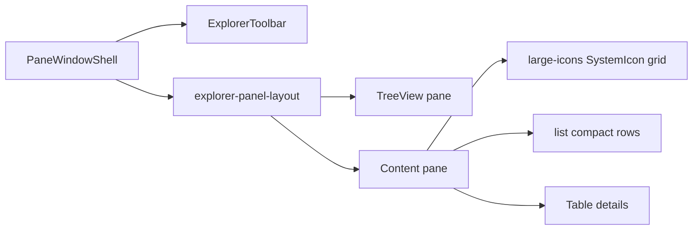

# FileExplorerWindow brick

> **Parent plan:** [Admin98_Product_Integration.md](./Admin98_Product_Integration.md)  
> **Brick:** `FileExplorerWindow` — **own** product brick (`bricks/FileExplorerWindow/`), **not** an `IconPanelWindow` variant. The Control Panel icon-grid window stays separate; the explorer tree + toolbar + view modes get their own layout.

## Scope (first slice)

Storybook-ready **layout brick** + fixture tree/list. Toolbar view switching works; Cut/Copy/Paste/Delete/Undo/Properties/Level-up: visual buttons + `on*` stub callbacks (no-op / action). **No** menu bar, **no** PHP/media API, **no** AdminDesktop wiring in this slice.

## Reference UI

- Left: `TreeView` (folder tree)
- Right: content — **large-icons** | **list** | **details** (small-icons skipped; the asset may remain unused)
- Above: tool buttons [`webhemi-ui/src/admin/assets/icons/toolbar/`](../../webhemi-ui/src/admin/assets/icons/toolbar/)
- Details columns: Name, Size, Type, Modified (Win98-style)
- Status bar: e.g. `N object(s)` (+ hidden count later)



## Data model (brick/page, not on the atom)

In WebHemi, File Explorer is **one site’s management window** (opened from the desktop website icon).

- **Title:** the website name
- **Title-bar icon:** site favicon; if missing → default `site` glyph
- **Tree roots (forest):**
  1. **Site** — website icon + name; under it in the tree **folders only** (documents appear in the content pane)
  2. **Media library** — under it in the tree **folders only**; assets appear in the content pane
  3. **Recycle Bin** — icon only, **not expandable** in the tree; contents are a flat list in the content pane
  4. **Settings** — **inactive** for now; later a separate window

```ts
type ExplorerItem = {
  id: string;
  label: string;
  kind: SystemIconKind;
  role?: ExplorerNodeRole; // site | folder | document | media-library | media-asset | trash | settings
  expandable?: boolean;    // false = recycle bin
  disabled?: boolean;      // settings (v1)
  children?: ExplorerItem[];
  // + typeLabel, sizeBytes, modifiedAt, hidden
};
```

`tree: ExplorerItem[]` (multiple roots). The content pane lists the selected node’s `children`.

## Glyph expansion

Alongside CMS `SystemIconKind`, explorer glyphs: `folder`, `folder-open`, `folder-documents`, `folder-gallery`, `file-document`, `file-image`, … (`icons/explorer/`). System/CMS glyphs: `icons/system/`. Toolbar: `icons/toolbar/`.

**Large icons:** existing `SystemIcon` (`labelTone="dark"`).  
**List / details:** brick-local rows — small (16px) glyph; the 90×90 `SystemIcon` is not suitable for compact lists.

## Component sketch

New folder: [`webhemi-ui/src/admin/bricks/FileExplorerWindow/`](../../webhemi-ui/src/admin/bricks/FileExplorerWindow/)  
(same level as `DialogWindow`, `IconPanelWindow`, `WizardWindow` — separate brick)

| File | Responsibility |
|------|----------------|
| `FileExplorerWindow.tsx` | `PaneWindowShell` + toolbar + split layout + statusBar |
| `ExplorerToolbar.tsx` | buttons + `VerticalBar`; view group `aria-pressed`; tool CSS class → SVG |
| `ExplorerContent.tsx` | render by `view` (grid / list / Table) |
| `FileExplorerWindow.stories.tsx` | fixture tree + items; Controls: `view` |
| `*.data.ts` | fixture (co-located) |

Props (sketch): `tree`, `items`, `view` / `onViewChange`, `selectedId` / `onSelect`, toolbar `onLevelUp` etc., `paneHeight`, `PaneWindowShell` props.

**Reuse:** only the shared shell (`PaneWindowShell`) and chrome atoms (`TreeView`, `Table`, `SystemIcon`, `Button`, `FieldBorder`). **Does not** wrap / extend `IconPanelWindow`.

## Styles

New product partial e.g. [`product/_explorer.scss`](../../webhemi-ui/src/admin/styles/product/_explorer.scss) + load from [`entry.scss`](../../webhemi-ui/src/admin/styles/entry.scss):

- `.explorer-panel-layout` — column: toolbar, then row: tree \| content (tree ~200px, FieldBorder/SunkenPanel white panes)
- `.explorer-toolbar` — icon-only buttons (CSS `background-image: url("/assets/admin/icons/toolbar/...")`), pressed state on view buttons
- `.explorer-list` / `.explorer-details` — list rows; details via existing `Table` atom in a scrollable host

## Storybook / export

- Title: `Admin/Bricks/FileExplorerWindow`
- [`preview.tsx`](../../webhemi-ui/.storybook/preview.tsx) `storySort` Bricks list: `FileExplorerWindow` next to the other windows
- Export: [`bricks/index.ts`](../../webhemi-ui/src/admin/bricks/index.ts)
- Short pointer: [Admin98_Product_Integration.md](./Admin98_Product_Integration.md)

## Intentional omissions (next slice)

- Menu bar (File/Edit/View…) — `menu.svg` later
- Tree ↔ content navigation / real level-up path stack
- Drag-drop, clipboard, properties dialog
- AdminDesktop open wiring; PHP AssetMapper sync for toolbar assets (verify at implementation time)
- Resizable splitter (v1: fixed tree width)
