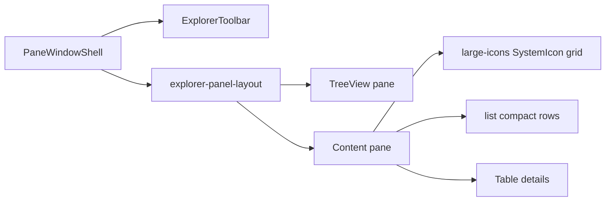

# FileExplorerWindow brick

> **Status:** slices A–I done; remaining = [`CURRENT.md`](./CURRENT.md) Phases 14–15 (PHP tree API, optional MenuBar extract).  
> **Parent plan:** [Admin98_Product_Integration.md](./Admin98_Product_Integration.md)  
> **Brick:** `FileExplorerWindow` — **own** product brick (`bricks/FileExplorerWindow/`), **not** an `IconPanelWindow` variant. The Control Panel icon-grid window stays separate; the explorer tree + toolbar + view modes get their own layout.

## Scope (first slice) — **done**

Storybook-ready **layout brick** + fixture tree/list. Toolbar view switching works; Cut/Copy/Paste/Delete/Undo/Properties/Level-up: visual buttons + `on*` stub callbacks (no-op / action). **No** window menu bar, **no** PHP/media API, **no** AdminDesktop wiring in this slice.

## Reference UI

- Left: `TreeView` (folder tree)
- Right: content — **large-icons** | **list** | **details** (small-icons skipped; the asset may remain unused)
- Above: tool buttons [`webhemi-ui/src/admin/assets/icons/toolbar/`](../../webhemi-ui/src/admin/assets/icons/toolbar/)
- Details columns: Name, Size, Type, Modified (Win98-style)
- Status bar: e.g. `N object(s)` (+ hidden count later)



## Data model (brick/page, not on the atom)

In WebHemi, File Explorer is **one site’s management window** (opened from the desktop website icon).

- **Title:** the website name
- **Title-bar icon:** site favicon; if missing → default `site` glyph
- **Tree roots (forest):**
  1. **Site** — website icon + name; under it in the tree **folders only** (documents appear in the content pane)
  2. **Media library** — under it in the tree **folders only**; assets appear in the content pane
  3. **Recycle Bin** — icon only, **not expandable** in the tree; contents are a flat list in the content pane
  4. **Settings** — **inactive** for now; later a separate window

```ts
type ExplorerItem = {
  id: string;
  label: string;
  kind: SystemIconKind;
  role?: ExplorerNodeRole; // site | folder | document | media-library | media-asset | trash | settings
  expandable?: boolean;    // false = recycle bin
  disabled?: boolean;      // settings (v1)
  children?: ExplorerItem[];
  // + typeLabel, sizeBytes, modifiedAt, hidden
};
```

`tree: ExplorerItem[]` (multiple roots). The content pane lists the selected node’s `children`.

## Glyph expansion

Alongside CMS `SystemIconKind`, explorer glyphs: `folder`, `folder-open`, `folder-documents`, `folder-gallery`, `file-document`, `file-image`, … (`icons/explorer/`). System/CMS glyphs: `icons/system/`. Toolbar: `icons/toolbar/`.

**Large icons:** existing `SystemIcon` (`labelTone="dark"`).  
**List / details:** brick-local rows — small (16px) glyph; the 90×90 `SystemIcon` is not suitable for compact lists.

## Component sketch

New folder: [`webhemi-ui/src/admin/bricks/FileExplorerWindow/`](../../webhemi-ui/src/admin/bricks/FileExplorerWindow/)  
(same level as `DialogWindow`, `IconPanelWindow`, `WizardWindow` — separate brick)

| File | Responsibility |
|------|----------------|
| `FileExplorerWindow.tsx` | `PaneWindowShell` + toolbar + split layout + statusBar |
| `ExplorerToolbar.tsx` | buttons + `VerticalBar`; view group `aria-pressed`; tool CSS class → SVG |
| `ExplorerContent.tsx` | render by `view` (grid / list / Table) |
| `FileExplorerWindow.stories.tsx` | fixture tree + items; Controls: `view` |
| `*.data.ts` | fixture (co-located) |

Props (sketch): `tree`, `items`, `view` / `onViewChange`, `selectedId` / `onSelect`, toolbar `onLevelUp` etc., `paneHeight`, `PaneWindowShell` props.

**Reuse:** only the shared shell (`PaneWindowShell`) and chrome atoms (`TreeView`, `Table`, `SystemIcon`, `Button`, `FieldBorder`). **Does not** wrap / extend `IconPanelWindow`.

## Styles

New product partial e.g. [`product/_explorer.scss`](../../webhemi-ui/src/admin/styles/product/_explorer.scss) + load from [`entry.scss`](../../webhemi-ui/src/admin/styles/entry.scss):

- `.explorer-panel-layout` — column: toolbar, then row: tree \| content (tree ~200px, FieldBorder/SunkenPanel white panes)
- `.explorer-toolbar` — icon-only buttons (CSS `background-image: url("/assets/admin/icons/toolbar/...")`), pressed state on view buttons
- `.explorer-list` / `.explorer-details` — list rows; details via existing `Table` atom in a scrollable host

## Storybook / export

- Title: `Admin/Bricks/FileExplorerWindow`
- [`preview.tsx`](../../webhemi-ui/.storybook/preview.tsx) `storySort` Bricks list: `FileExplorerWindow` next to the other windows
- Export: [`bricks/index.ts`](../../webhemi-ui/src/admin/bricks/index.ts)
- Short pointer: [Admin98_Product_Integration.md](./Admin98_Product_Integration.md)

---

## Next slices (one function → one commit)

Implement **separately** so each can be reviewed before commit. Suggested order:

### Slice A — Tree ↔ content navigation / level-up — **done**

- Keep `locationId` (listing) separate from `selectedId` (content highlight)
- Tree click → set location; content double-click on folder/location → enter; documents stay no-op open
- Real **Up** via parent lookup (`findExplorerParent`); disabled on forest roots
- Tree shows current `locationId` (`aria-current`); auto-expand ancestors when location changes
- Storybook play covers enter folder + Up (`Navigation` story)

### Slice B — Window menu bar (File / Edit / View / Help) — **done**

Classic menubar **above** the toolbar (Win98 Explorer chrome). **Not** related to `menu.svg`.

> **`menu.svg`:** Start-menu **button** icon on the taskbar (`#toolbar button.menu` → `icons/system/menu.svg`). Owned by Phase 5 shell / taskbar — **not** the explorer window menubar.

#### Menu matrix (CMS-mapped, not full OS clone)

| Menu | Items | Notes |
|------|--------|--------|
| **File** | New Folder, New Page, Open, Rename, Delete, Properties, Close | New Page = document under site tree; Delete → Recycle Bin; Close = window |
| **Edit** | Undo, Cut, Copy, Paste, Select All | Mirror toolbar stubs until clipboard exists |
| **View** | Large Icons, List, Details, Refresh, Status Bar | View modes = toolbar toggles; Refresh later with data |
| **Help** | About File Explorer… | Optional; can ship last / stub |

**Omit (OS-only, no product fit):** Favorites, Go, Map Network Drive, Format, Create Shortcut, Find Files.

Until a handler exists, items stay **disabled** (same spirit as toolbar stubs). Menubar items call the same `on*` handlers as the toolbar where they overlap. Implemented as brick-local `ExplorerMenuBar` (chrome atom extraction later if other windows need it). Storybook: `MenuBar` play.

### Slice C — AdminDesktop open wiring — **done**

- Site desktop icon → `SiteFileExplorer` (stateful `FileExplorerWindow` host) instead of stub `DialogWindow`
- Default forest: `buildEmptySiteExplorerTree` (empty roots until PHP nav/media API)
- Storybook uses `buildDemoSiteExplorerTree` (Acme fixture remapped per site)
- Toolbar SVG assets already under `assets/admin/icons/toolbar/` (UI + synced PHP) — no extra sync work
- Close: title-bar Close + File → Close

### Slice D — Delete → Recycle Bin (+ Undo) — **done**

- Local forest edits in `SiteFileExplorer` (`explorerTreeOps`)
- Delete moves selection into Recycle Bin; Delete inside trash removes permanently
- Single-step Undo restores the last delete
- Toolbar / File menu Delete & Edit Undo enable only when the action applies
- Storybook: `Admin/Bricks/SiteFileExplorer` → `DeleteToRecycleBin`

### Slice E — Cut / Copy / Paste clipboard — **done**

- In-memory clipboard on `SiteFileExplorer` (cut moves on paste; copy keeps clipboard)
- Paste into current location (not trash/settings); block paste into a cut folder's descendants
- Cut item ghosted via `cutItemId` / `.is-cut`
- Undo covers last paste as well as delete
- Storybook: `CutCopyPaste`

### Slice F — Properties dialog — **done**

- Read-only General sheet (`ExplorerPropertiesDialog`) for the selected item
- Overlay centered on `SiteFileExplorer`; toolbar / File → Properties
- Fields: Type, Location (parent label), Size, Modified
- Storybook: `Properties`

### Slice G — Resizable tree/content splitter — **done**

- `ExplorerSplitter` between tree and content (drag + ArrowLeft/Right/Home/End)
- Uncontrolled by default; optional `treeWidth` / `onTreeWidthChange`
- `treePaneResizable` to disable; min/max defaults 120–480px
- Storybook: `FileExplorerWindow` → `Splitter`

### Slice H — Multi-select + Select All — **done**

- Content multi-select: click replace, Ctrl/Cmd toggle, Shift range
- Edit → Select All selects the current listing
- Delete / Cut / Copy operate on the full selection; Properties only when exactly one item
- Status bar shows `N object(s) selected` while a selection is active
- Storybook: `SelectAll`

### Slice I — Drag-drop move — **done**

- HTML5 DnD from content items (selection or single drag source)
- Drop onto content folders or tree location nodes
- Move uses same rules as cut + paste (`moveExplorerItems`); Undo restores
- Drag-over highlight (`.is-drag-over`)
- Storybook: `DragDropMove`

### Later slices (unchanged backlog)

- Extract `ExplorerMenuBar` into a reusable chrome `MenuBar` atom if other windows need it
- PHP-supplied explorer tree (replace empty / demo forests)


