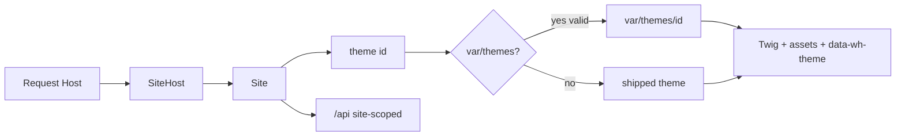

# Frontend sites and themes

> **Status:** accepted design (2026-08-14); Phase 9 Hello world **implemented** (seams live); zip / Themes CP remain Phase 14.  
> **Parent:** [CURRENT.md](./CURRENT.md) · [Admin_API_Access_Mode.md](./Admin_API_Access_Mode.md) · [Admin98_Integration_Contract.md](./Admin98_Integration_Contract.md).  
> **Language:** English only.

## Intent

Lock the dual public stack (**site API + site UI**) for **N sites** (Host → Site), and the **swappable frontend theme** model (shipped WebHemi themes + operator-uploaded packages under `var/themes`), so Phase 9 Hello world lays the right seams without building the Themes Control Panel or CMS yet.

## Locked decisions

### Dual stack (admin vs site)

| Surface | API | UI |
|---------|-----|-----|
| **Admin** | Protected admin API (path: `/admin/api`; domain: admin host `/api`) | Retro OS — `data-wh-theme="admin"` |
| **Site** | Every `surface=site` host at `/api` (Host → Site scope) | That site’s **frontend theme** — `data-wh-theme="<theme-id>"` |

- Admin and frontend auth stay separate ([Admin_API_Access_Mode.md](./Admin_API_Access_Mode.md)).
- There is **one** PHP runtime: Host resolves Site; Site selects theme; theme renders UI. Not one deployable app per subdomain.
- Non–main sites never get an `admin` host surface; public API is always path-based on the site host.

### Multi-site

- Arbitrary Hosts (including custom subdomains) assign to Sites — already the Sites/Hosts product model.
- Request on `{siteHost}/…` → resolve Host → Site → theme → render (or public API under that Site).
- Hello world must **prove** this path even with stub content: two hosts on two sites should not share a hard-coded single-page assumption.

### Theme layers (do not conflate)

| Layer | Role | Marketplace / zip? |
|-------|------|--------------------|
| **Admin theme** | Product chrome only | **No** — not a site theme package |
| **Shipped frontend themes** | Boxed WebHemi product (first theme polished; 2–3 colour variants later) | Shipped with the product; same **runtime contract** as uploads |
| **Uploaded frontend themes** | Operator zip install | **Yes** — validated, stored under `var/themes/` |

Self-contained themes remain the contract ([Admin98_Integration_Contract.md](./Admin98_Integration_Contract.md) D4): no shared UI kit with Admin; each theme owns tokens, templates/assets, and optional chrome.

### Authoring vs runtime

| Concern | Home |
|---------|------|
| **First-party authoring** | `webhemi-ui` Storybook / `themes/<id>` (and a future external theme-builder app) |
| **Runtime package** | Installable theme directory consumed by **webhemi-php** (Twig + static assets + manifest). Production stays **zero-Node**. |

Shipped themes are **exported/synced** into the runtime shape. Operator zips must match that same shape. Third-party themes are not “React packages dropped into the monorepo”.

### On-disk layout (PHP)

```text
# Shipped / synced (part of product tree or AssetMapper sync — versioned with release)
assets/themes/<theme-id>/     # static assets (see webhemi-php/assets/themes/README.md)
templates/themes/<theme-id>/  # Twig (or equivalent) — exact path locked in Phase 9 impl

# Operator-uploaded (never committed; under gitignored var/)
var/themes/<theme-id>/
  theme.json                  # manifest (required)
  templates/…                 # theme templates
  assets/…                    # theme static files
```

**Resolver precedence (locked):** for a given `theme-id`, prefer **`var/themes/<id>`** if present and valid; else shipped product theme. Collision: upload must not silently overwrite a shipped id without an explicit product rule (v1: **reject** upload whose `id` matches a shipped theme id).

### Site → theme assignment

- Each Site has a **theme id** (slug string matching `theme.json` `id`), defaulting to the first shipped WebHemi theme (e.g. `webhemi` or `default` — pick one id in Phase 9 and keep it stable).
- Assignment is per Site (WordPress-like): changing theme does not change Hosts or content tree identity.
- Phase 9 may seed/default only; CP Themes window and zip UI are Phase 14.

### Runtime manifest (`theme.json`)

Minimum fields for validation and listing:

| Field | Purpose |
|-------|---------|
| `id` | Stable slug; `data-wh-theme` value; folder name must match |
| `name` | Human label |
| `version` | Semver string |
| `engine` | e.g. `webhemi-php` (reserve for later multi-engine) |
| `requires` | Optional min product version |

Phase 9 stub may use a minimal manifest on the shipped theme only. Zip upload validation (Phase 14) checks: archive layout, `id`/folder match, required files present, path traversal / unsafe entries rejected, no overwrite of shipped ids.

### Public Hello world / thin public API

Phase 9 should include a **thin** site-scoped public API proof (not CMS):

- Example: `GET /api/site` (name TBD) returns site identity + active `themeId` for the current Host’s Site.
- Auth: public or frontend session as designed later; **never** admin session.
- Reserved paths remain blocked from content ([Admin_API_Access_Mode.md](./Admin_API_Access_Mode.md)).

Rich content resolution stays [Site_Content_Model.md](./Site_Content_Model.md) (Phase 10).



## Phase mapping

### Phase 9 — Hello world (this ADR’s MVP)

**In scope**

1. Host → Site resolve on site hosts for `/` (and layout).
2. Site → theme id (DB field or equivalent; default shipped theme).
3. Theme resolver (shipped path; `var/themes` lookup stub OK even if empty).
4. One shipped stub frontend theme: welcome on `/`, `data-wh-theme="<id>"`.
5. Thin public `GET` under `/api` proving Site scope.
6. Respect reserved paths; no CMS tree.

**Out of scope for Phase 9**

- Zip upload, Themes Control Panel window  
- Colour-variant family (second/third shipped skins)  
- Full manifest validation suite  
- Document/folder public routing (Phase 10)  
- External theme-builder app  

### Phase 10 — Site content

Uses the same Site (and later theme hooks for indexes/templates). Theme **assignment** already exists; public resolve picks templates from the active theme. Slice 5: [Site_Content_Slice5.md](./Site_Content_Slice5.md). Detail: [Site_Content_Model.md](./Site_Content_Model.md).

### Phase 14 — Control Panel: Themes window

- List shipped + `var/themes` packages (from manifests).
- Upload zip → validate → extract under `var/themes/<id>/`.
- Enable/disable or delete uploaded themes (block delete if any Site still assigned — or force reassign; pick in impl).
- Per-Site theme picker (CP and/or Site settings interior).
- Do **not** treat Admin theme as an installable row in this window.

### Later / packaging

- Additional shipped colour variants after the first theme is polished.
- Release packaging must document `var/themes` and shipped theme paths ([CURRENT.md](./CURRENT.md) Phase 11).

## Out of scope (this ADR)

- Theme-builder application UX  
- Selling / marketplace hosting outside the product  
- Making frontend themes Retro OS  
- webhemi-js / Payload theme packaging (map later to the same manifest idea if needed)

## Open decisions (resolve in implementation slices)

- ~~Exact shipped theme **id**~~ → locked **`default`** (Phase 9)
- ~~Exact Twig root path~~ → shipped: `templates/themes/<id>/`; uploaded: `var/themes/<id>/templates/`
- Whether Site settings (explorer Settings root) exposes theme picker in Phase 10 or only CP Themes in Phase 14  
- Upload: allow “override” of uploaded themes with same id (replace) vs versioned folders  

## Related

- [Admin_API_Access_Mode.md](./Admin_API_Access_Mode.md) — dual API, reserved paths, Host → Site `/api`  
- [Admin98_Integration_Contract.md](./Admin98_Integration_Contract.md) — `data-wh-theme`, self-contained themes  
- [Site_Content_Model.md](./Site_Content_Model.md) — CMS after Hello world  
- [Installer_and_Protected_Base_Site.md](./Installer_and_Protected_Base_Site.md) — protected Main pair  
- [CURRENT.md](./CURRENT.md) — Phase 9 / 10 / 14 status  
