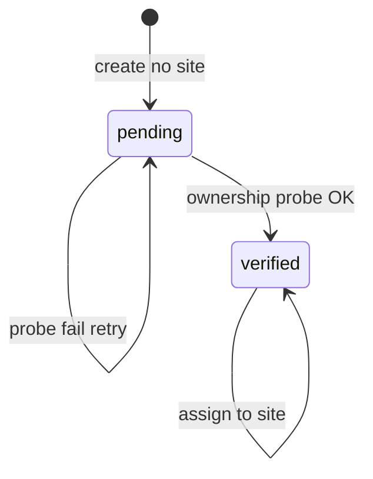

# Host ownership verification (pending → verified → assign)

> **Status:** done — see [`CURRENT.md`](./CURRENT.md). Naming: Verification + Enabled/Disabled (no ownership `active`).  
> **Parent:** [Admin98_Phase6_Admin_Windows.md](./Admin98_Phase6_Admin_Windows.md) (Hosts follow-up after Slice E)  
> **Domain service (exists):** [`HostOwnershipVerifier`](../../webhemi-php/src/SiteHost/Verification/HostOwnershipVerifier.php)  
> **Legacy note:** [`webhemi-php/docs/host-ownership-verification-flow.md`](../../webhemi-php/docs/host-ownership-verification-flow.md) — probe mechanics still valid; **lifecycle / assignment rules below supersede** older “create with site / admin→active skip” product rules.

## Product decision (locked)

Hostname ownership is proven with a **short-lived file + token** served from this WebHemi install and fetched **via the candidate hostname**.

**Two separate fields on a host:**

| Field | Values | Meaning |
|-------|--------|---------|
| **Verification** (`verification` column) | `pending` \| `verified` | Ownership probe result |
| **Status** (`is_enabled` / API `enabled`) | Enabled \| Disabled | Kill switch (like Sites) |

```text
(create host, no site, enabled)  →  verification pending
        ↓  successful ownership probe
     verification verified
        ↓  assign to a site
      site FK set (verification stays verified)
```

Rules:

1. **Create** a host **without** binding it to a site. Verification = `pending`. Enabled may be on; the host is usable for tenant routing only when **enabled**, **verified**, and **assigned** to a site (routing uses `isEnabled` today).
2. **Verify** (`host.verify`): probe OK → verification `verified`. Failure → stay `pending`.
3. **Assign to a site** only when verification is `verified` and unassigned. Assignment sets the site FK; verification stays `verified` (no third “active” ownership value).
4. **Only verified, unassigned** hosts appear in Sites → Assign.
5. Surfaces (`admin` | `site` | `api`) are entry purpose, not a verify bypass.



## Probe mechanics (unchanged service)

Canonical implementation: `App\SiteHost\Verification\HostOwnershipVerifier`.

## Status

**H1–H4 done.** Naming clarified: Verification vs Status (Enabled/Disabled); ownership no longer uses `active` as a verification value.
