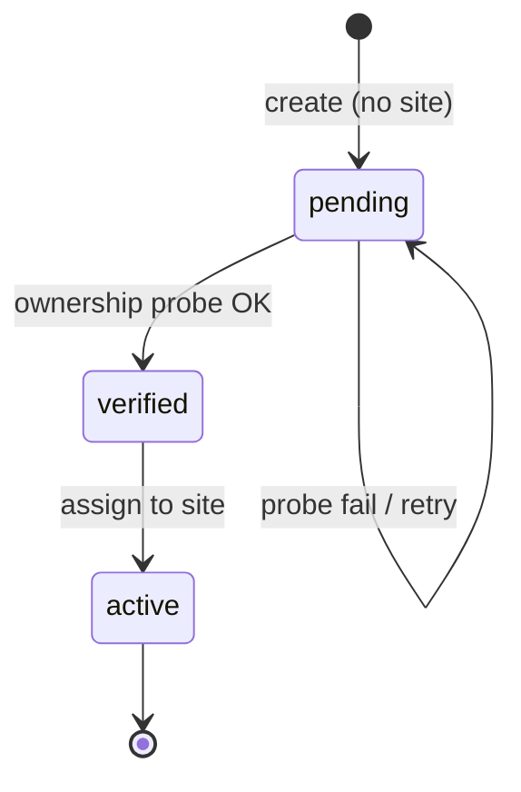

# Host ownership verification (pending → verified → active)

> **Parent:** [Admin98_Phase6_Admin_Windows.md](./Admin98_Phase6_Admin_Windows.md) (Hosts follow-up after Slice E)  
> **Domain service (exists):** [`HostOwnershipVerifier`](../../webhemi-php/src/SiteHost/Verification/HostOwnershipVerifier.php)  
> **Legacy note:** [`webhemi-php/docs/host-ownership-verification-flow.md`](../../webhemi-php/docs/host-ownership-verification-flow.md) — probe mechanics still valid; **lifecycle / assignment rules below supersede** that doc’s “create with site / admin→active skip” product rules.

## Product decision (locked)

Hostname ownership is proven with a **short-lived file + token** served from this WebHemi install and fetched **via the candidate hostname**. Status progression:

```text
(create host, no site)  →  pending
        ↓  successful ownership probe
     verified
        ↓  assign to a site
      active
```

Rules:

1. **Create** a host **without** binding it to a site. Status = `pending`. `isActive` may stay `true` as a row flag, but the host is **not** usable for tenant routing until `active` status.
2. **Verify** (`host.verify`): run `HostOwnershipVerifier` (temp file under `public/`, GET `http(s)://{host}/{token}.txt`, body must equal `webhemi-host-verification:{token}`, then delete file). Success → status `verified`. Failure → stay `pending` (operator can retry).
3. **Assign to a site** only when status is `verified` (Sites Hosts tab / Hosts edit / dedicated Assign). Assignment → status `active`.
4. **Only `verified` hosts** appear as assignable in Sites → Hosts (or equivalent). `pending` hosts are listed in Hosts window for verify; `active` hosts are already bound.
5. Surfaces (`admin` | `site` | `api`) describe **entry purpose**, not a verify bypass. **All surfaces** use the same ownership probe before they can become `active` via site assignment. (This replaces the older “admin/api skip probe → active” rule.)

Unassign / re-verify / delete: out of scope until the happy path ships; note as follow-ups.



## Probe mechanics (unchanged service)

Canonical implementation: `App\SiteHost\Verification\HostOwnershipVerifier`.

1. Generate token; write `public/{token}.txt` with body `webhemi-host-verification:{token}`.
2. Request that path on the candidate host (http/https, optional current-request port).
3. Match trimmed body to expected content.
4. Always unlink the temp file (`finally`).

Do **not** reimplement the probe in React. UI only triggers API + shows result.

## Gap vs current Phase 6 Slice E

| Area | Today (Slice E) | Target |
|------|-----------------|--------|
| Create body | `siteId` **required** | `siteId` **omitted** on create; optional later only via assign |
| Create status | always `pending` (OK) but already has site | `pending`, **no** site FK until assign |
| Verify API | missing (`admin_hosts_verify` redirects) | `POST /admin/api/hosts/{id}/verify` + `host.verify` + CSRF |
| Assign | create-time only | explicit assign (or Hosts edit) when `verified` → `active` |
| Sites Hosts tab | any host checkbox | only `verified` (unassigned) + already assigned to this site |
| Entity | `site` ManyToOne **nullable: false** | site must become **nullable** until assign (migration) |

## Acceptance criteria

- [ ] Operator can create a hostname from Hosts window without choosing a site; row shows `pending`.
- [ ] **Verify** action (Hosts window) calls API; on success status becomes `verified`; on failure stays `pending` with clear error (Slice F feedback OK).
- [ ] Sites → Hosts (or Hosts assign) only lists **verified, unassigned** hosts plus hosts already on that site; cannot assign `pending`.
- [ ] Assigning a verified host to a site sets status `active` and sets the site FK.
- [ ] Probe uses existing `HostOwnershipVerifier`; no duplicate client-side HTTP check.
- [ ] Permission: verify requires `host.verify`; create/assign require `host.edit` (assign may also need `site.edit` — decide in implement slice).
- [ ] Storybook: Hosts list states `pending` / `verified` / `active`; Verify + Assign plays with mocked API (MSW optional / 6b).

## Suggested implementation slices

### H1 — Schema + create without site

- Make `SiteHost::$site` nullable (Doctrine migration).
- `CreateHostInput`: drop required `siteId`; keep `host`, `surface`, `active?`.
- `HostCreator`: persist with `status=pending`, no site.
- Adjust GET mapper (`siteId` / names null-safe).
- Update Hosts UI create form: no Site select on New (surface + hostname only).
- Unit tests.

### H2 — Verify API + Hosts UI action

- `POST /admin/api/hosts/{id}/verify` (`host.verify`, CSRF).
- Load host; if not `pending` (or allow re-verify from `verified` only when unassigned — MVP: `pending` only), run verifier; set `verified` or return error envelope.
- Hosts window: **Verify** enabled for selected `pending` row; refresh list.
- Storybook play + PHP unit/integration as appropriate.

### H3 — Assign verified → active

- `POST /admin/api/hosts/{id}/assign` body `{ siteId }` (or PATCH); require status `verified` and null site; set site + `active`.
- Wire Sites `SiteFormDialog` Hosts tab: checkboxes = verified-unassigned ∪ this site’s hosts; **Add…** still opens Hosts for create/verify.
- Reject assign of `pending` with `422`.
- After assign, Sites host counts / desktop refresh as today.

### H4 — Docs + seed alignment

- Update `webhemi-php/docs/host-ownership-verification-flow.md` to point here for product rules.
- Seed hosts: either `active` with site (fixtures) or document that seed skips probe (dev only).
- Hub README capability row: pending → verified → active via assign.

## Explicitly out of scope (until criteria expand)

- DNS TXT alternative to file probe.
- Automatic verify on create (always operator-triggered for MVP).
- Detach host from site / demote `active` → `verified`.
- Deep links to Hosts / Verify.
- Changing how request host resolves tenants beyond requiring `active` + site (routing follow-up).

## Status

**Planned** — not started. Phase 6 Slice E remains list+create with current (temporary) `siteId`-on-create API until H1 replaces it.
