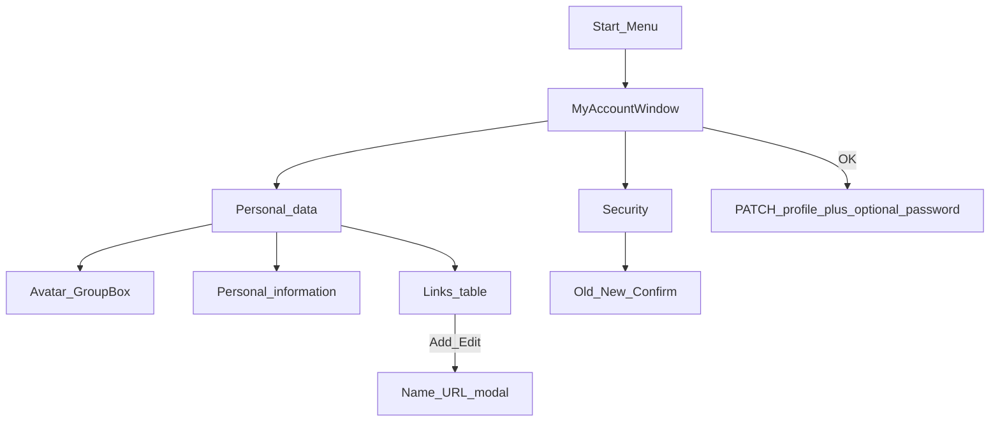
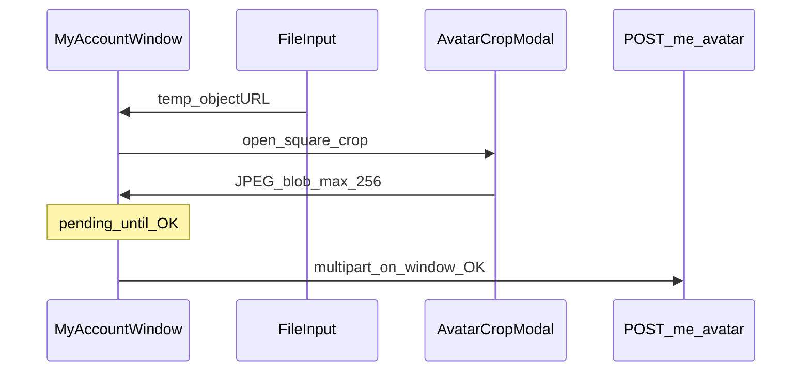

# My Account — Personal data + Security

> **Status:** implemented (UI + API; migrate before use).  
> **Decisions locked:** **1A** full avatar — order **Default → Gravatar → Upload**; Default = `assets/system/avatar_default.svg`; Gravatar from Email field; Upload → temp file → square crop (`react-image-crop`) → ≤256×256 JPEG; **2A** email editable; window **OK** saves profile; password only if New+Confirm filled (empty = no-op).  
> **Parent:** [Users_RBAC_and_My_Account.md](./Users_RBAC_and_My_Account.md) · [Users_Window.md](./Users_Window.md) · [CURRENT.md](./CURRENT.md).  
> **Language:** English only.

## Goal

Replace Start → **My Account** (password-only `SetPasswordDialog`) with a tabbed **My Account** window:

1. **Personal data** — avatar, profile fields, links table  
2. **Security** — self password change (same fields/rules as today)

CP → Users → **Set Password…** keeps using `SetPasswordDialog` unchanged.

## Product surface (vs ChatGPT mockup)

| Mockup | Ours |
|--------|------|
| Title “User Settings” | **My Account** |
| Generic window icon | Start menu **My Account** glyph (`my_account.svg`) |
| Flat blue title bar | Our gradient title bar |
| Minimize + Maximize + Close | **Minimize + Close** (no Maximize; taskbar button like Users) |
| Legends “1. Avatar”, “2. …” in blue | **Avatar**, **Personal information** — no numbers; **black** legend text |
| Links as textarea | Headerless table + **Add** / **Edit** / **Delete** (Users-list density) |
| — | Add/Edit opens nested modal: **Name** + **URL** |

### Personal data

- **Avatar** (radio order): **Default** → **Gravatar** → **Upload**.
  - **Default:** preview uses shipped SVG [`assets/system/avatar_default.svg`](../../webhemi-ui/src/admin/assets/system/avatar_default.svg) (generic user pictogram; generate in implementation).
  - **Gravatar:** preview from the **current Email field** value (live as the user types; MD5 of normalized lower/trim email). Selecting Gravatar does not use a separate gravatar-email field.
  - **Upload:**
    1. Chrome atom **`FileInput`** (new Storybook atom — Retro “path + Browse…” like the mockup; no file input exists today).
    2. Chosen image is held as a **temporary** in-memory / object-URL file (not yet on the server).
    3. Opens a **crop modal** (`react-image-crop`) — **square** aspect only.
    4. On crop OK: rasterize to **JPEG**, max **256×256**, keep as pending blob until window **OK** posts `POST /me/avatar`.
- **Fields:** Name, Email (editable), Telephone, Address, ZIP (short), City, Country; **Bio** textarea.
- **Links:** single-column headerless table (show **name**; URL in `title` tooltip). Side stack: Add / Edit / Delete. Rows are **draft until window OK** (replace-sync), so Cancel discards safely.

### Security

- Old + New + Confirm (self rules). Empty New+Confirm on OK → **no password API call** (no-op). Partial/invalid → validation + chord error modal.

### Footer

- **OK** — save sequence below; close on full success.  
- **Cancel** — discard draft, close.

## Data model

[`Users_Window.md`](./Users_Window.md) notes legacy DB columns `avatar_type` / `avatar_path` already exist but are **unmapped**. Map them; add profile columns; new link table.

### `app_user` (extend)

| Column | Notes |
|--------|--------|
| `avatar_type` | `default` \| `upload` \| `gravatar` (map existing) |
| `avatar_path` | nullable relative blob key for upload (map existing) |
| `display_name` | nullable (UI “Name”) |
| `telephone`, `address`, `zip`, `city`, `country` | nullable strings |
| `bio` | nullable text |
| `email` | existing; unique; editable here |

### `app_user_link` (new)

`id`, `user_id` (FK → `app_user` ON DELETE CASCADE), `name`, `url`, `position` INT; index on `user_id`.

### Avatar storage

Not site `media_asset` (site-scoped). Store under `var/avatars/{ab}/{hash}` (same hash pattern as `MediaBlobStore`). Serve `GET /admin/api/me/avatar` for upload preview.

**Default asset:** `webhemi-ui/src/admin/assets/system/avatar_default.svg` (synced to PHP `assets/admin/system/`).

**Gravatar:** client + API derive `https://gravatar.com/avatar/{md5(lower(trim(email)))}?s=150&d=identicon` from the profile email; do not store the URL. Preview in the form uses the draft Email field. (`s` = CDN pixel size; `d=identicon` is the fallback when no Gravatar is registered.)

**Upload pipeline (client):**

- Dependency: [`react-image-crop`](https://www.npmjs.com/package/react-image-crop) in `webhemi-ui`.
- Crop modal: Retro `DesktopModal` + dialog chrome; Confirm writes square JPEG ≤256×256 into pending state (replace prior pending crop).

## API

| Method | Path | Purpose |
|--------|------|---------|
| `GET` | `/admin/api/me/profile` | Self profile + links + resolved `avatarUrl` |
| `PATCH` | `/admin/api/me/profile` | Personal fields + `avatarType` + `links: [{name,url}]` replace-sync |
| `POST` | `/admin/api/me/avatar` | Multipart **JPEG** (cropped) → write `avatar_path`, type becomes `upload` |
| `POST` | `/admin/api/users/{id}/password` | Existing; only if Security New+Confirm non-empty |

**OK sequence**

1. If Security has new password → validate client-side; `POST …/password` (fail → chord, stay open).  
2. If avatar mode is **Upload** and a pending cropped JPEG exists → `POST …/avatar`.  
3. `PATCH …/profile` with fields + links + `avatarType` (`default` \| `gravatar` \| `upload`).  
4. Close on success; refresh any desktop “me” email cache if email changed.

Auth: authenticated self (`ROLE_USER`); no `user.edit` required for own profile (same spirit as self password).

## UI / wiring

- New chrome atom: **`FileInput`** (`chrome/FileInput/`) — label + readonly path TextBox + Browse button triggering hidden `<input type="file" accept="image/*">`; Storybook under `Admin/Atoms/FileInput`.
- New product pieces: `AvatarCropModal` (uses `react-image-crop`), `MyAccountWindow`.
- Default pictogram SVG under `assets/system/avatar_default.svg`.
- [`AdminDesktop.tsx`](../../webhemi-ui/src/admin/pages/AdminDesktop.tsx): Start → My Account opens `MyAccountWindow`.
- API client + MSW + Storybook story for My Account.
- Keep [`SetPasswordDialog.tsx`](../../webhemi-ui/src/admin/components/UsersWindow/SetPasswordDialog.tsx) for Users CP.

## Out of scope

- CP Users **Change Settings** showing the same profile editor  
- Public site rendering of profile/avatar  
- Email verification / confirmation mail on change (unique + normalize only)

## Implementation order

1. `avatar_default.svg` + `FileInput` atom + `react-image-crop` dependency  
2. Migration + `User` / `UserLink` entities; map `avatar_type` / `avatar_path`  
3. Profile mapper/updater + avatar blob store + routes + unit tests  
4. `AvatarCropModal` + `MyAccountWindow` (tabs, avatar radios, fields, links, Security)  
5. AdminDesktop + client + MSW + stories  
6. Mark this plan done; update [Users_RBAC_and_My_Account.md](./Users_RBAC_and_My_Account.md) and [CURRENT.md](./CURRENT.md)
