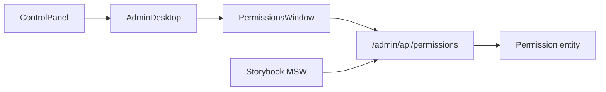

# Permissions window (then Roles, then Users)

> **Status:** done (Phase 4).  
> **Parent:** [CURRENT.md](./CURRENT.md) · [RBAC_Reset.md](./RBAC_Reset.md) R4.  
> **Language:** English only.

## Build order vs CURRENT.md

[CURRENT.md](./CURRENT.md) previously listed Phase 4 Users → 5 Roles → 6 Permissions. Product build order is the reverse (permissions catalog before roles attach them, before users assign roles). **Reorder CURRENT phases 4–6** to:

4. Permissions → 5. Roles → 6. Users

R4 in [RBAC_Reset.md](./RBAC_Reset.md) already defines the CRUD/lock rules; this work is that R4 start.

**This plan = Phase 4 only (Permissions).** Roles and Users are outlined at the end as follow-ons, not in the same implementation pass.

## Product rules (Permissions v1)

| Rule | Detail |
|------|--------|
| Fields | `name` (unique code, lowercased), `label`, `description` (text, optional empty) |
| CRUD | Full create / edit / delete |
| Locks | None in UI v1 (readonly flags deferred per RBAC_Reset) |
| Seed | Empty catalog (already true after R1) |
| Auth | Admin-only: `permission.list` / `permission.edit` (already in `RbacAttributes`) |
| Delete | If still attached to roles → `409` (refuse with clear message) |

Name validation: non-empty, max 128, pattern suitable for dotted codes (e.g. `content.edit`) — lowercase via entity `setName`.

## Architecture (mirror Sites)

Same split as Sites: PHP JSON API → `createAdminApiClient` → window props from AdminDesktop → Retro chrome table + form dialog.

## Slice A — PHP API

Entity already exists: `webhemi-php/src/Entity/Permission.php` (`name`, `label`, `description`, `isReadOnly`).

Add (Sites pattern from `AdminApiController`):

- `GET/POST /admin/api/permissions`, `GET/PATCH/DELETE /admin/api/permissions/{id}`
- `CreatePermissionInput` / `UpdatePermissionInput` / `PermissionApiMapper` → `{ id, name, label, description }`
- Creator / Updater / Deleter services + unique-name conflict → `409`
- Deleter: if `roles` non-empty → `409` with message to detach from roles first
- `#[IsGranted('permission.list'|'permission.edit')]` + CSRF on mutations
- Unit tests under `tests/Unit/Api/`
- Deep link `?window=permissions` is enough for CP (optional legacy redirect later)

## Slice B — UI window + API client

Clone Sites shape, simpler (no hosts/assign):

- `webhemi-ui/src/admin/components/PermissionsWindow/` — `PermissionsWindow.tsx`, form dialog, stories, product SCSS
- Table columns: Name, Label, Description
- Form: name + label + description; New / Edit / Delete + confirm dialog (same MessageDialog pattern)
- Client: `listPermissions` / `createPermission` / `updatePermission` / `deletePermission` in `api/client.ts` + types in `api/types.ts`

## Slice C — Shell + Control Panel + deep link + MSW

- Shell kind `'permissions'`, `PERMISSIONS_WINDOW_ID`, default size, persistence, taskbar class (title-bar/SystemIcon `permissions` already exist)
- `ControlPanel.tsx`: wire `onOpenPermissions` (today selection-only stub)
- `AdminDesktop.tsx`: open/load/mount like Sites
- `deepLink.ts`: `window=permissions` (+ `?id=` → `preferSelectedId`)
- MSW handlers + fixtures + AdminDesktop story(s)
- Export from `admin/index.ts`

## Docs

- Update [CURRENT.md](./CURRENT.md) phase 4–6 order; mark Phase 4 in progress then done
- Touch RBAC_Reset R4 status when Permissions lands

## Follow-on (not this PR)

**Phase 5 — Roles:** CRUD + attach/detach permissions checklist; lock `ROLE_ADMIN` / `ROLE_SITE_ADMIN` (no edit/delete); `role.*` grants.

**Phase 6 — Users:** CRUD + global roles + `site_assignment` (site + Site Admin / custom role); `user.*` grants.

## Out of scope now

- Readonly permission flags UI
- Roles / Users windows
- Changing PermissionVoter (already Admin-only for `permission.*`)
- Column sorting on Table atom
