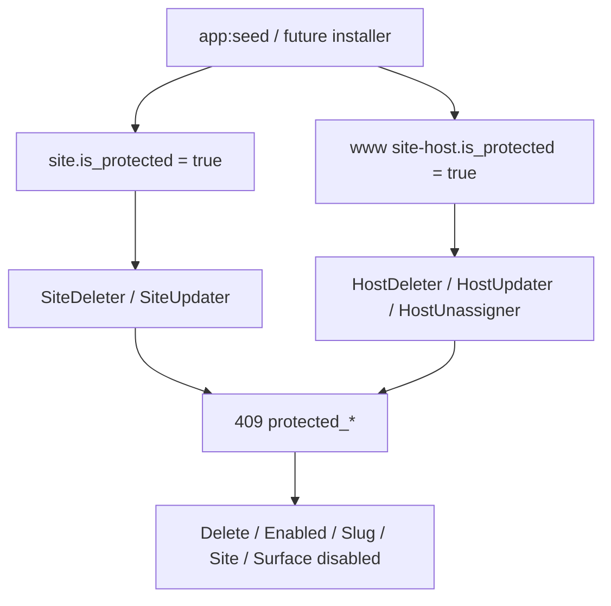

# Protected Main site and primary www host

> **Status:** done (API/UI flags); installer still later.  
> **Parent:** [Installer_and_Protected_Base_Site.md](./Installer_and_Protected_Base_Site.md) · [CURRENT.md](./CURRENT.md) Phase 9.  
> **Language:** English only.

## Product rules (locked)

From [Installer_and_Protected_Base_Site.md](./Installer_and_Protected_Base_Site.md):

| Asset | Locked | Still allowed |
|-------|--------|----------------|
| Main **site** (`isProtected`) | Delete; disable; **slug** change | Rename **name** |
| Primary **www / site-surface** host (`isProtected`) | Delete; disable; unassign; surface ≠ `site` | Rename **hostname** (same row; domain string can change) |
| Admin-surface host | **Not** protected (existing access-mode reset flow stays) | — |

Identity is an explicit DB flag (not “slug === main” alone), so later installer/seed can mark the pair without heuristic surprises. `Site::isMain()` / slug `main` remains the routing convention; protected site must keep slug `main`.

## PHP

1. **Schema** — migration adding `is_protected` boolean (default `false`) on `site` and `site_host`.
2. **Backfill in same migration**:
   - All sites with `slug = 'main'` → `is_protected = true`
   - For each such site: the primary **site-surface** host (prefer `www.*`, else lowest id — same idea as `SiteHostRepository::findMainSiteHost`) → `is_protected = true`
   - Never mark `surface=admin` hosts protected
3. **Entities** — `Site::isProtected()` / `setIsProtected()`; same on `SiteHost`. No public API to flip the flag.
4. **Guards** (e.g. `SiteProtectedException`, `HostProtectedException`):
   - `SiteDeleter` — reject protected
   - `SiteUpdater` — reject slug change or `enabled=false` on protected
   - `HostDeleter` — reject protected
   - `HostUpdater` — reject disable / surface≠site / unassign path on protected
   - `HostUnassigner` — reject protected
5. **Controller** — map to **409** with stable codes (`site_protected`, `host_protected`) + field hints where useful.
6. **Mappers** — add `protected: bool` to `SiteApiMapper` / `HostApiMapper`.
7. **Seed** — `SeedCommand`: set `isProtected` on Main site + `--site-host` row; leave `--admin-host` unprotected.
8. **Tests** — unit coverage for delete/update/unassign rejection; seed/backfill expectations.

## UI

1. Types + window rows carry `protected`.
2. **Sites** — Delete disabled when selected site is protected; form: slug + Enabled readonly/disabled (name editable); title/tooltip e.g. “Protected system site”.
3. **Hosts** — Delete disabled when selected host is protected; form: Site/Surface/Enabled locked when `protected` (hostname editable).
4. Sites Hosts tab **Remove** — disable when selected host is protected (API 409 as backstop).
5. Stories: Main protected fixtures; assert Delete disabled.

## Docs when done

- Mark flags slice done in [Installer_and_Protected_Base_Site.md](./Installer_and_Protected_Base_Site.md) and [CURRENT.md](./CURRENT.md) Phase 9 (installer still open).
- Touch [Admin_API_Access_Mode.md](./Admin_API_Access_Mode.md) protected Main line if needed.

## Out of scope

- Full installer wizard
- Changing which host is protected after seed (no promote/demote API)
- Blocking hostname edits on the primary host (allowed on purpose)

## Commit messages (when implementing)

**webhemi-php:** `feat: Protect Main site and primary www host from delete and disable.`  
**webhemi-ui:** `feat: Lock Sites/Hosts UI for protected Main site and www host.`  
**hub:** `docs: Mark protected base flags slice planned/done.`
