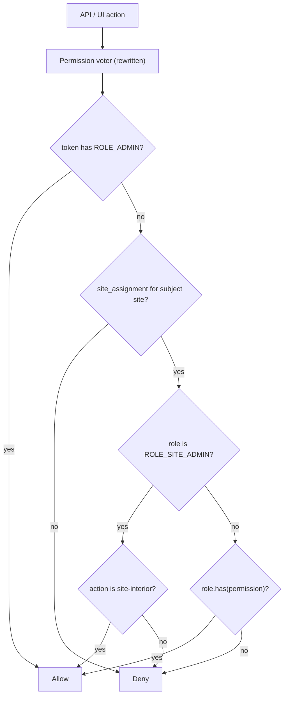

# RBAC reset — Admin + Site Admin baseline

> **Status:** R1–R3 done (2026-08-09); R4 Permissions done; Roles/Users next.  
> **Parent:** [CURRENT.md](./CURRENT.md).  
> **Language:** English only.

## Why

The legacy (pre-hub) WebHemi.PHP RBAC had conflicting roles, ignored permissions, and hard-to-reason voters (e.g. `ROLE_EDITOR` mixed with a fuzzy `ROLE_SITE_ADMIN`). **Do not evolve the buggy permission catalog or Editor role.** Rebuild from two clear system roles + empty seed permissions + full CRUD for experiments.

## Locked product rules

| Rule | Detail |
|------|--------|
| **Admin (`ROLE_ADMIN`)** | System role. **Protected:** not deletable, not editable. Global full access: all sites + **Control Panel** (Users, Roles, Permissions, Settings, Hosts/Sites identity, …). Seed assigns this to the primary admin user only. |
| **Site Admin (`ROLE_SITE_ADMIN`)** | System role. **Protected:** not deletable, not editable. Used **only** via `site_assignment` (user + site + this role) — not as a global CP login role. On that site: **full interior management** (content, site-internal settings TBD, etc.). **Cannot:** delete the site; change site identity in ways reserved to Admin; manage hosts / ownership; use Control Panel. Those stay `ROLE_ADMIN`. |
| **Authorize** | `ROLE_ADMIN` → allow. Else: `site_assignment` for the subject site → if role is `ROLE_SITE_ADMIN` and the action is **site-interior**, allow; else `assignment.role.has(permission-XY)`. |
| **Permission catalog (seed)** | **Empty at seed.** Strip legacy permission rows. Operators may **create / edit / delete** permissions for testing. |
| **Other roles (seed)** | **None** besides Admin + Site Admin. No `ROLE_EDITOR`. Operators may **create / edit / delete** custom (non-protected) roles for testing. |
| **Protected vs custom** | Locked: **Admin** and **Site Admin**. Everything else (custom roles + all permissions) is fully mutable for experiments. |
| **Non-admin users** | Get site power only through `site_assignment` (typically Site Admin, later finer roles). No CP. |
| **Readonly later** | After the permission set is deliberate, mark readonly permissions; then decide default-readonly **custom** roles. System roles stay protected regardless. |

### Site Admin scope (intent)

| Allowed (assigned site) | Denied (always for Site Admin) |
|-------------------------|--------------------------------|
| Site interior / content / future site settings (TBD) | Control Panel windows |
| Full day-to-day management of that site’s content tree (when File Explorer / content APIs exist) | Delete the site; disable/slug/protect-style site identity edits reserved to Admin |
| | Host create / edit / delete / verify / assign / unassign |
| | Install settings (`access.admin`, …), users/roles/permissions APIs |

Exact permission codes for the “allowed” column land when content APIs exist; until then Site Admin short-circuits a documented allow-list of attributes (or denies all dotted perms that are CP/host/site-destructive).

## Current code to replace / strip

| Area | Today | Target |
|------|--------|--------|
| `SeedCommand` | Many permissions + `ROLE_EDITOR` + Admin | Seed **Admin** + **Site Admin** (both protected); **no** permissions; **no** Editor; admin user → Admin only |
| `PermissionVoter` | Admin OR assignment with Site Admin = allow almost anything / `hasPermission` | Rewrite per diagram: Site Admin ≠ global allow; CP/host/site-destroy stay Admin-only |
| Migrations | Editor cruft; Site Admin seed exists | Keep/ensure Site Admin protected; drop Editor; clear permissions; mark both system roles protected |
| API grants | Dotted perms assuming seed catalog | CP / hosts / site delete → Admin; site-interior → Admin or Site Admin on that site |
| Roles CP | — | Full CRUD for custom roles; **lock Admin + Site Admin** |

`site_assignment` **stays** — primary way to grant Site Admin (or later custom roles) on a site.

## Work slices (when implementing)

### R1 — Data + seed — **done**

1. Map existing `is_read_only` on Role/Permission; Admin + Site Admin = true.
2. Migration: clear permissions; remove non-system roles (Editor, …); ensure Admin + Site Admin exist and are protected.
3. `app:seed` / `CreateAdminUserCommand`: Admin user + `ROLE_ADMIN` only; seed Site Admin role row (unassigned until an operator assigns via Users / site_assignment).

### R2 — Voter — **done**

1. Rewrite per mermaid; explicit deny list for Site Admin (CP, host.*, site delete/identity, settings.*).
2. Unit tests: Admin allow-all; Site Admin allow interior / deny host delete; custom role needs `has(permission)`.

### R3 — API attributes — **done** (dotted grants + matrix above)

1. Control Panel + host + protected site mutations: `ROLE_ADMIN` (or dotted names that only Admin passes).
2. Document interim attribute matrix when R2 lands.

### R4 — CP windows — full CRUD for testing

| Window | CRUD | Lock |
|--------|------|------|
| Users | create / edit / delete; global roles + **site_assignment** (pick site + Site Admin / custom role) | — |
| Roles | create / edit / delete; attach permissions | **Admin** and **Site Admin**: no delete, no edit |
| Permissions | create / edit / delete | none in v1 (readonly flags later) |

Seed Roles = `[Admin, Site Admin]`, Permissions = `[]`; still add custom rows for tests.

## Deferred (explicit)

- Canonical permission codes and which are readonly  
- Default-readonly **custom** roles  
- Exact “site interior settings” surface (TBD)  
- UI: Sites list filtered to assigned sites for non-Admin  
- Frontend (public) auth — dual firewall unchanged  

## Interim attribute matrix (R3)

| Attribute pattern | `ROLE_ADMIN` | `ROLE_SITE_ADMIN` (assigned site) | Custom role |
|-------------------|--------------|-------------------------------------|-------------|
| `host.*`, `settings.*`, `user.*`, `role.*`, `permission.*` | allow | deny | `has(permission)` only |
| `site.edit`, `site.delete` | allow | deny | `has(permission)` only |
| `site.list`, future `content.*` / site-interior | allow | allow | `has(permission)` only |

Live Admin API still uses dotted `#[IsGranted]` names; with an empty seed catalog only Admin passes host/settings/site.edit. Site Admin passes `site.list` (and future interior codes) on assigned sites.

Column `rbac_role.is_read_only` / `rbac_permission.is_read_only` = product **protected** lock (mapped on entities).

## Relation to CURRENT.md

**Phase 3b** = this reset (R1–R3) before Users / Roles / Permissions. Phases 4–6 assume Admin + Site Admin protected and empty permission seed.

## Commit messages (when implementing)

**webhemi-php:** `refactor: Reset RBAC to protected Admin and Site Admin roles.`  
**hub:** `docs: Lock RBAC reset with Site Admin site-interior scope.`
