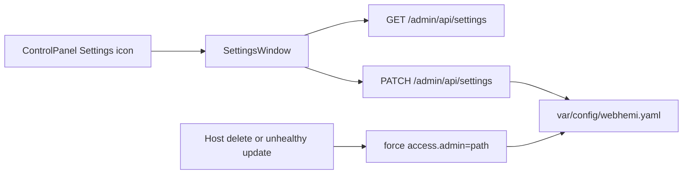

# Settings window (access.admin)

> **Status:** done (ADR slice 6).  
> **Parent:** [Admin_API_Access_Mode.md](./Admin_API_Access_Mode.md) · [CURRENT.md](./CURRENT.md) Phase 1.  
> **Language:** English only.

## Scope

ADR slice 6 only: **`access.admin` path | domain**. No path editing, no themes/users tabs.

Follow-up (**done**): Symfony debug toolbar checkbox — [Settings_Symfony_Debug_Toolbar.md](./Settings_Symfony_Debug_Toolbar.md).

**UI (first cut):** Settings window body is one **GroupBox** (`legend`: `Admin access`) containing one **FieldRow** with Radio `domain` and Radio `path`. Domain radio disabled when `domainAvailable` is false.



## PHP API

Add settings endpoints on `AdminApiController` (or a thin `SettingsApiController` under `/admin/api`):

- `GET /admin/api/settings` — `#[IsGranted('settings.list')]`
- `PATCH /admin/api/settings` — `#[IsGranted('settings.edit')]` + CSRF `admin_api`

Response shape (example):

```json
{
  "adminAccess": "domain",
  "effectiveAdminAccess": "domain",
  "domainAvailable": true,
  "adminHost": { "id": 11, "host": "admin.webhemi.local" },
  "paths": { "admin": "/admin", "adminApi": "/admin/api", "publicApi": "/api", "login": "/login", "register": "/register" }
}
```

- `adminAccess` = configured value in yaml
- `effectiveAdminAccess` = `AdminEntryResolver` (already falls back to path when no healthy admin host)
- `domainAvailable` = `findMainAdminHost() !== null`
- PATCH body: `{ "adminAccess": "path" | "domain" }` only
- Reject `domain` with **422** when `!domainAvailable` (do not write yaml)
- On successful save: `WebhemiConfigLoader::save()` keeping existing path keys

### Permissions

Seed `settings.list` + `settings.edit` (`ROLE_ADMIN` already passes any `*.*` via `PermissionVoter`). Editors do not get these.

### Auto-reset to path

Shared helper e.g. `AdminAccessModeResetter::resetToPathIfNeeded()`:

- If configured mode is `domain` and `findMainAdminHost()` is null → save `path`

Wire from:

- `HostDeleter` after remove/flush — returns whether reset happened; DELETE `/hosts/{id}` responds with JSON `{ deleted, sessionEnded?, loginUrl?, accessModeReset? }` and invalidates the session when reset (same re-login pattern as Settings PATCH). Hosts UI shows an escalated warning confirm when deleting the admin-surface host while `access.admin=domain`.
- `HostUpdater` / `HostUnassigner` — same session-end payload on PATCH `/hosts/{id}` and POST unassign when the healthy Main admin host is lost (surface→site, disable, unassign). Host/Site forms warn before those edits.

Runtime routing fallback stays as today (no yaml write required for requests to keep working).

Unit tests: PATCH validation, GET payload, resetter on delete/unhealthy update; keep routing tests untouched.

## UI (`webhemi-ui`)

Mirror Sites/Hosts shell pattern:

1. Shell: add `SETTINGS_WINDOW_ID`, kind `'settings'` + persistence/taskbar/`defaultSizeForKind`
2. `ControlPanel`: `onOpenSettings` like Sites/Hosts
3. New `SettingsWindow` (HeadingPanelWindow): one **GroupBox** legend `Admin access`, one **FieldRow** with Radio **domain** and Radio **path**. Domain radio disabled when `!domainAvailable`; status/error feedback like Sites.
4. `AdminDesktop`: open/raise Settings, load/save via admin API client
5. Storybook story for SettingsWindow (fixture props; no PHP)

Sync UI into PHP AssetMapper after build.

## Docs when done

- Mark slice 6 **done** in [Admin_API_Access_Mode.md](./Admin_API_Access_Mode.md)
- Close or update Phase 1 in [CURRENT.md](./CURRENT.md)

## Commit messages

**webhemi-php:** `feat: Add Settings API for admin access mode and reset on host loss.`  
**webhemi-ui:** `feat: Add Settings window for path vs domain admin access.`  
**hub:** `docs: Mark access-mode Settings slice done.`
