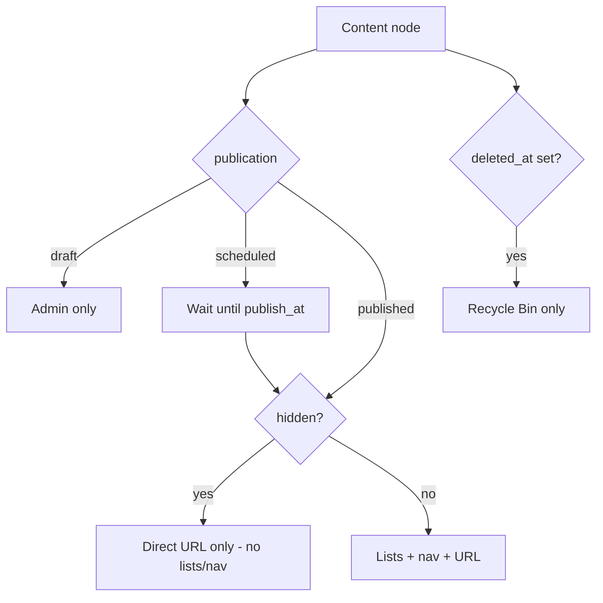

# Site content model (explorer, media, trash, settings)

> **Status:** planning (ADR draft); **scheduled as CURRENT Phase 10** (after Phase 9 Hello world).  
> **Parent:** [CURRENT.md](./CURRENT.md) · [FileExplorer_Window.md](./FileExplorer_Window.md) · [RBAC_Reset.md](./RBAC_Reset.md).  
> **Language:** English only.

## Intent

Finish the **admin site interior** as far as product design allows before a rich public frontend. The existing File Explorer forest already sketches four roots — **Site**, **Media library**, **Recycle Bin**, **Settings**. This note locks the data model and MVP boundaries so the PHP tree API and later public routing share one contract.

**Phase order (locked):** [CURRENT.md](./CURRENT.md) **Phase 9 Hello world** first (minimal `/`), then **Phase 10** implements this ADR. Do not start schema/explorer content APIs until Hello world is done.

Hello world stays minimal/static; **rich content is Phase 10** guided by this ADR.

## Explorer forest (product UI)

One window per site (desktop site icon), as in [FileExplorer_Window.md](./FileExplorer_Window.md):

| Root | Tree | Content pane |
|------|------|----------------|
| **Site** | Folders only under the site node | Children of selected folder (documents, links, media refs, subfolders) |
| **Media library** | Folders only | Uploaded assets in selected folder |
| **Recycle Bin** | Not expandable | Flat list of soft-deleted items (restore / purge) |
| **Settings** | N/A (opens settings surface) | Site settings (separate panel/window later; inactive stub OK until then) |

Reserved URL prefixes (`/admin`, `/api`, `/login`, `/register`, …) must never appear as content paths — [Admin_API_Access_Mode.md](./Admin_API_Access_Mode.md).

## Core concepts

### Nodes (site content tree)

Source of truth is the **database**, not the filesystem. Blobs live in object/file storage keyed by content hash.

| Kind | Role | Children | Public URL shape (sketch) |
|------|------|----------|---------------------------|
| **folder** | Non-leaf | Yes | Directory, trailing slash, default auto-index |
| **document** | Leaf — edited HTML/body | No | `…/{slug}.html` |
| **media_ref** | Leaf — pointer into media library | No | Serves or links the blob (extension from asset) |
| **redirect** | Leaf — internal or external target | No | Resolves to redirect response |

**MVP folder types** (stored enum; unused types may exist later without UI):

| Type | v1 | Behavior |
|------|----|----------|
| `normal` | **Yes** | Auto-index lists child documents (and optionally media_refs) per theme rules |
| `locale` | **Yes** (optional multi-lang) | Special root(s) for language trees; drives `lang` / hreflang |
| `gallery` | Later | Index images/videos under the folder (often a view filter on `normal`) |
| `file_list` | Later | Index non-image binaries |
| `filter_list` | **Later / phase 2** | Virtual children from tags/categories/dates — do not implement in v1 |

### Media library

- Separate tree root from Site content.
- Each uploaded blob stored **once** by **content hash** (dedupe). Display filename is metadata; the same basename may appear in different folders.
- Site tree **media_ref** nodes (and WYSIWYG embeds) reference the media id/hash; one asset may be used in many places.
- Deleting a tree `media_ref` or document does **not** delete the blob until nothing references it (refcount / usage table) **or** the operator purges orphans deliberately.

### Recycle Bin (soft delete)

- Soft-delete flag (prefer `deleted_at` + `deleted_by` + restore metadata such as `original_parent_id` / path snapshot — not only a bare `is_deleted` boolean long-term).
- Soft-deleting a **folder** soft-deletes all descendants.
- Recycle Bin UI: **flat** list; restore returns items to original parent when possible (conflict policy: rename or block with message).
- **Empty recycle bin** = hard delete DB rows + eligible blobs (refcount zero).

### Site settings

Site-interior settings (Site Admin), distinct from Control Panel **Sites** identity (Admin):

| Field | Notes |
|-------|--------|
| Name | Editable |
| Description / SEO defaults | Editable |
| Favicon | Upload / replace via media |
| Hosts | **Read-only** list of assigned hostnames; optional “Manage in Hosts…” only for `ROLE_ADMIN` |
| Assigned users | Read-only or limited invite later — avoid Hosts permission spaghetti in v1 |

Protected Main site rules still apply for CP identity ([Protected_Main_Base_Guards.md](./Protected_Main_Base_Guards.md)).

## Visibility & publication

Orthogonal axes — do not overload soft-delete:

### Publication status

Applies to listable nodes (folders, documents, media_refs, redirects) as product rules require:

| Status | Meaning |
|--------|---------|
| `draft` | Editable in admin; **not** on the public site |
| `published` | Live when other rules allow |
| `scheduled` | Becomes published at `publish_at` (server-side job or request-time check) |

### Hidden

Boolean **`hidden`** (independent of publication):

- When `hidden = true`, the node is **omitted from public listings, auto-indexes, menus, and navigations**.
- Direct URL access policy (v1 proposal): **still reachable by exact URL** if `published` (or scheduled→live), unless we later add “hidden + no direct access”. Document the choice in implementation; default = **direct URL OK, lists hide it** (classic “unlisted”).
- Admin explorer: show hidden items (badge/glyph); optional “show hidden” already foreshadowed on the brick.
- Soft-deleted items are only in Recycle Bin — not merely `hidden`.

## RBAC (sketch)

| Actor | Site tree / media / trash / site settings | CP Sites/Hosts/Users |
|-------|---------------------------------------------|----------------------|
| Site Admin (assignment) | Full interior for that site | No |
| Admin | Yes (all sites) | Yes |

Exact `content.*` / `media.*` / `site_settings.*` codes land with the APIs ([RBAC_Reset.md](./RBAC_Reset.md)).

## Engine-agnostic contract

PHP Twig and future webhemi-js must consume the **same** node/media/trash model via admin/public APIs. No filesystem-path identity for documents.

## Implementation slices (Phase 10)

After Phase 9 Hello world. Order inside Phase 10:

1. **Schema + APIs** — nodes, media blobs/refs, soft-delete, publication + hidden  
2. **Explorer PHP tree** — replace fixture forest  
3. **Site settings surface** — activate Settings root  
4. **Document editor** — MVP document create/edit (WYSIWYG scope TBD)  
5. **Public routing** — resolve folder indexes + `.html` leaves + redirects; honor reserved paths  
6. **filter_list / gallery / file_list** — phase 2 folder types (after Phase 10 MVP)  
7. **Installer** — seed empty protected tree + locale optional (still deferred, CURRENT Phase 15)

## Out of scope (this ADR)

- Choosing WYSIWYG vendor  
- Themes Control Panel window  
- Full installer wizard  
- Implementing filter_list virtual trees  
- Dual-engine Payload collections (later map to this model)

## Open decisions

- Direct URL to `hidden` + `published` nodes: allow (unlisted) vs 404  
- Whether folders have publication status or only inherit/visibility flags  
- Locale: single optional `locale` root vs one folder per language under site root  
- Trash restore naming collisions  
- Scheduled publish: cron vs lazy evaluate on request  

## Related

- [FileExplorer_Window.md](./FileExplorer_Window.md) — UI brick + forest  
- [Installer_and_Protected_Base_Site.md](./Installer_and_Protected_Base_Site.md) — protected Main pair  
- [Admin_API_Access_Mode.md](./Admin_API_Access_Mode.md) — reserved paths  
