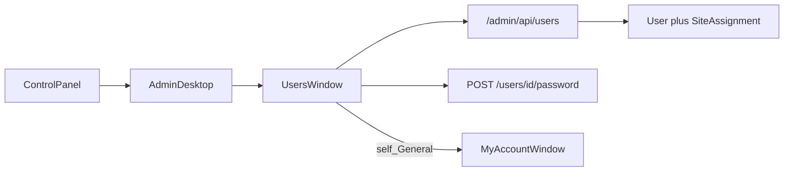

# Users window

> **Status:** done (Phase 6 UI + [Users_RBAC_and_My_Account.md](./Users_RBAC_and_My_Account.md); General tab profile fields + self → My Account).  
> **Parent:** [CURRENT.md](./CURRENT.md) · [RBAC_Reset.md](./RBAC_Reset.md) R4 · [My_Account_Profile.md](./My_Account_Profile.md).  
> **Language:** English only.

## Product rules (Users v1)

| Rule | Detail |
|------|--------|
| Fields (New / edit **other**) | **Name**, **email**, **password** required (edit: empty password = unchanged); telephone, address, ZIP, city, country optional; global `roleIds` (≥1, New defaults to `ROLE_GUEST`), `siteAssignments` |
| Self edit (General) | Info + **My Account…**. Roles / Sites still apply; ≥1 role required |
| Default role | New users get **ROLE_GUEST** when no roles chosen; empty role list rejected |
| CRUD | Full create / edit / delete (gated by `user.create` / `user.edit` / `user.delete`) |
| Password | Create: required. Edit other: optional single field. Self: My Account Security / **Set Password…** |
| Global roles | `user_role` M2M. **`ROLE_SITE_ADMIN` is not assignable globally** (site_assignment only). Admin + custom roles OK |
| Site assignments | One role per site (`site_assignment`). Role = Site Admin or **custom** (not `ROLE_ADMIN`) |
| Safety | No self-delete; refuse delete / strip of `ROLE_ADMIN` when it would leave zero Admins |
| Auth | Open list: `ROLE_USER` (self always; others need Admin/`user.list`). Mutations: `user.create` / `user.edit` / `user.delete`. See [Users_RBAC_and_My_Account.md](./Users_RBAC_and_My_Account.md) |
| Avatar / bio / links | Self only via [My Account](./My_Account_Profile.md) |
| UI layout | Win9x **User Settings** style: User List tab, single-column list, Set Password / Change Settings fieldset |

## Architecture

Mirror Roles API wiring; **UI layout is deliberately different** (classic User Settings).

## API

- `GET/POST /admin/api/users`, `GET/PATCH/DELETE /admin/api/users/{id}`
- `POST /admin/api/users/{id}/password` — self: `{ currentPassword, password, confirmPassword? }`; other (Admin/`user.edit`): `{ password, confirmPassword? }` (no current). 409 `password_mismatch` if self current is wrong
- `GET /admin/api/me` — `{ user, id, email, roles, capabilities }`
- Mapper: `{ id, email, displayName, telephone, address, zip, city, country, roleIds, roles, siteAssignments, roleCount, siteAssignmentCount }`
- Create body: `{ email, password, displayName?, telephone?, address?, zip?, city?, country?, roleIds?, siteAssignments? }`
- Update body (PATCH): same profile fields optional; `password?` (omit/empty = unchanged); `roleIds?` / `siteAssignments?` replace-sync when provided
- 409: `email_taken`, `self_delete`, `last_admin`, `invalid_role`
- CSRF on mutations; list/show/password: `ROLE_USER` + `UserAccess`; create/edit/delete: `user.create` / `user.edit` / `user.delete`

## UI

- Title bar glyph: `users`. Intro icon: `user_list.svg`. Settings fieldset icon: `change_password.svg`. Self General: `dialog_info.svg` + My Account…
- Fixed size (not resizable, no status bar); `min-width: 480px`
- Tab: **User List**
- Single-column list (email only) + **New User…** / **Delete**
- Fieldset **Settings for {email}**: **Set Password…** / **Change Settings…**
- Bottom: **Close** + disabled **Cancel**
- Start → **My Account**; deep link: `?window=users` / `?window=users&id=`

## Out of scope

- Filtering Sites list for non-Admin (deferred in RBAC_Reset)
- Seeding `user.*` catalog rows (operators create as needed; `user.` remains admin-only for Site Admin auto-deny)
