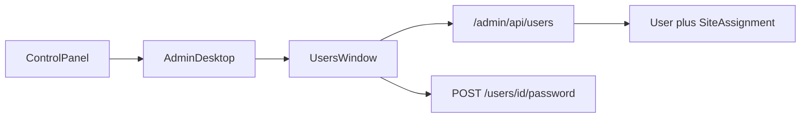

# Users window

> **Status:** done (Phase 6 UI + [Users_RBAC_and_My_Account.md](./Users_RBAC_and_My_Account.md)).  
> **Parent:** [CURRENT.md](./CURRENT.md) · [RBAC_Reset.md](./RBAC_Reset.md) R4.  
> **Language:** English only.

## Product rules (Users v1)

| Rule | Detail |
|------|--------|
| Fields | `email` (unique, normalized lower/trim), password on **create only**, global `roleIds`, `siteAssignments` |
| CRUD | Full create / edit / delete (gated by `user.create` / `user.edit` / `user.delete`) |
| Password | Create: required on New User. Self: **Set Password…** / Start → My Account (Old + New + Confirm). Other: New + Confirm only (`user.edit`\|Admin; no current password) |
| Global roles | `user_role` M2M. **`ROLE_SITE_ADMIN` is not assignable globally** (site_assignment only). Admin + custom roles OK |
| Site assignments | One role per site (`site_assignment`). Role = Site Admin or **custom** (not `ROLE_ADMIN`) |
| Safety | No self-delete; refuse delete / strip of `ROLE_ADMIN` when it would leave zero Admins |
| Auth | Open list: `ROLE_USER` (self always; others need Admin/`user.list`). Mutations: `user.create` / `user.edit` / `user.delete`. See [Users_RBAC_and_My_Account.md](./Users_RBAC_and_My_Account.md) |
| Avatar | Out of scope (DB columns exist; entity unmapped) |
| UI layout | Win9x **User Settings** style (not the Sites/Roles heading-table pattern): User List tab, single-column list, Set Password / Change Settings fieldset |

## Architecture

Mirror Roles API wiring; **UI layout is deliberately different** (classic User Settings).

## API

- `GET/POST /admin/api/users`, `GET/PATCH/DELETE /admin/api/users/{id}`
- `POST /admin/api/users/{id}/password` — self: `{ currentPassword, password, confirmPassword? }`; other (Admin/`user.edit`): `{ password, confirmPassword? }` (no current). 409 `password_mismatch` if self current is wrong
- `GET /admin/api/me` — `{ user, id, email, roles, capabilities }`
- Mapper: `{ id, email, roleIds, roles: [{id,name,label}], siteAssignments: [{id, siteId, siteName, roleId, roleName, roleLabel}], roleCount, siteAssignmentCount }`
- Create body: `{ email, password, roleIds?, siteAssignments?: [{siteId, roleId}] }`
- Update body (PATCH): `{ email?, roleIds?, siteAssignments? }` — replace-sync for lists when provided; **no password**
- 409: `email_taken`, `self_delete`, `last_admin`, `invalid_role` (e.g. Site Admin as global / Admin as site role)
- CSRF on mutations; list/show/password: `ROLE_USER` + `UserAccess`; create/edit/delete: `user.create` / `user.edit` / `user.delete`

Also tighten `RoleDeleter`: refuse delete if role is still used via `site_assignment` (not only `user_role`).

## UI

- Title bar glyph: `users` (system). Intro icon: `user_list.svg`. Settings fieldset icon: `change_password.svg`. Keep product title-bar gradient.
- Fixed size (not resizable, no status bar); `min-width: 480px`
- Tab: **User List**
- Single-column list (email only, no table header) + **New User…** / **Delete** (capability-gated)
- Fieldset **Settings for {email}**: **Set Password…** / **Change Settings…** (or View Settings when `user.view` only)
- Bottom: **Close** + disabled **Cancel** (classic User Settings)
- Start → **My Account** (self password); deep link: `?window=users` / `?window=users&id=`

## Out of scope

- Avatar
- Filtering Sites list for non-Admin (deferred in RBAC_Reset)
- Seeding `user.*` catalog rows (operators create as needed; `user.` remains admin-only for Site Admin auto-deny)
