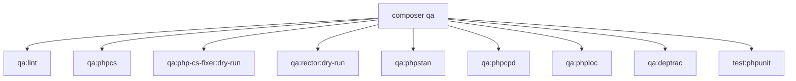

# QA Pipeline Commands

This document is the command-level reference for local QA checks.

## Composer script graph



## Commands

From project root:

```bash
composer qa:lint
composer qa
```

## Script definitions (source of truth)

Current scripts are defined in `composer.json`:

- `qa:lint`: `bash bin/php-lint`
- `qa:phpcs`: PSR-12 check in `src`
- `qa:php-cs-fixer:dry-run`: formatting diff without writing
- `qa:rector:dry-run`: rector preview without writing
- `qa:phpstan`: static analysis
- `qa:phpcpd`: copy/paste detector
- `qa:phploc`: project metrics
- `qa:deptrac`: architecture boundaries
- `test:phpunit`: test suite

## Fix commands

```bash
composer fix:phpcbf
composer fix:php-cs-fixer
composer fix:rector
composer fix
```

## Pre-commit hook

Repository-managed Git hooks include a pre-commit QA run.

```bash
chmod +x .githooks/pre-commit
git config core.hooksPath .githooks
```

## References

- `composer.json`
- `bin/php-lint`
- `.githooks/pre-commit`
