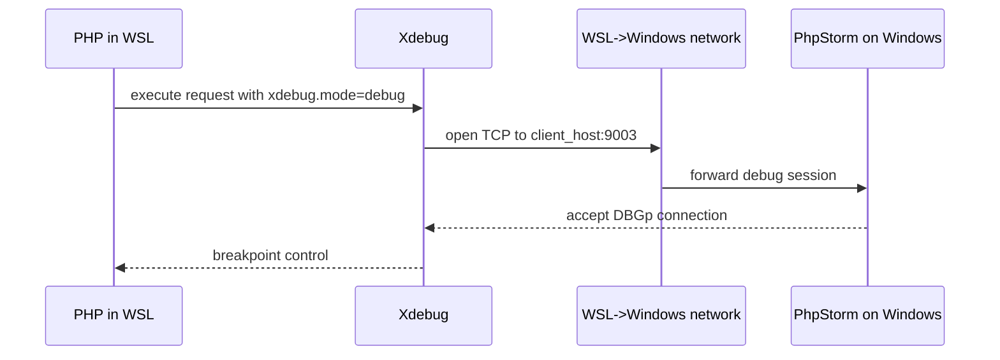

# Xdebug WSL to PhpStorm Setup

This guide documents a working baseline for debugging when PHP runs in WSL and PhpStorm runs on Windows.

## Top causes when breakpoints do not hit

- `XDEBUG_MODE=coverage` environment override disables step debugging
- PhpStorm is not listening on port `9003`
- `xdebug.client_host` is not reachable from WSL
- Firewall blocks inbound connection to PhpStorm debug port

## Connection model



## Recommended baseline

1. Remove coverage-only env override from shell startup if present:

```bash
# Example line to remove/comment in ~/.zshrc
export XDEBUG_MODE=coverage
```

2. Confirm Xdebug is loaded and step debugger is enabled:

```bash
php --ri xdebug
```

3. Set explicit host and disable auto discovery in your Xdebug config (example values):

```ini
xdebug.mode=debug
xdebug.start_with_request=yes
xdebug.discover_client_host=0
xdebug.client_host=<windows-host-from-wsl>
xdebug.client_port=9003
```

4. From WSL, test TCP reachability while PhpStorm is listening:

```bash
timeout 1 bash -lc '</dev/tcp/<windows-host-from-wsl>/9003' && echo OK || echo FAIL
```

5. In PhpStorm:
- Enable "Start Listening for PHP Debug Connections"
- Ensure path mappings match your WSL project path

## Notes

- `<windows-host-from-wsl>` is often the nameserver IP from `/etc/resolv.conf` in WSL.
- Values can vary by machine and network policy.

## References

- `~/.zshrc` (environment overrides)
- PhpStorm debug settings (port and path mappings)
